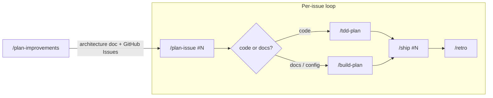
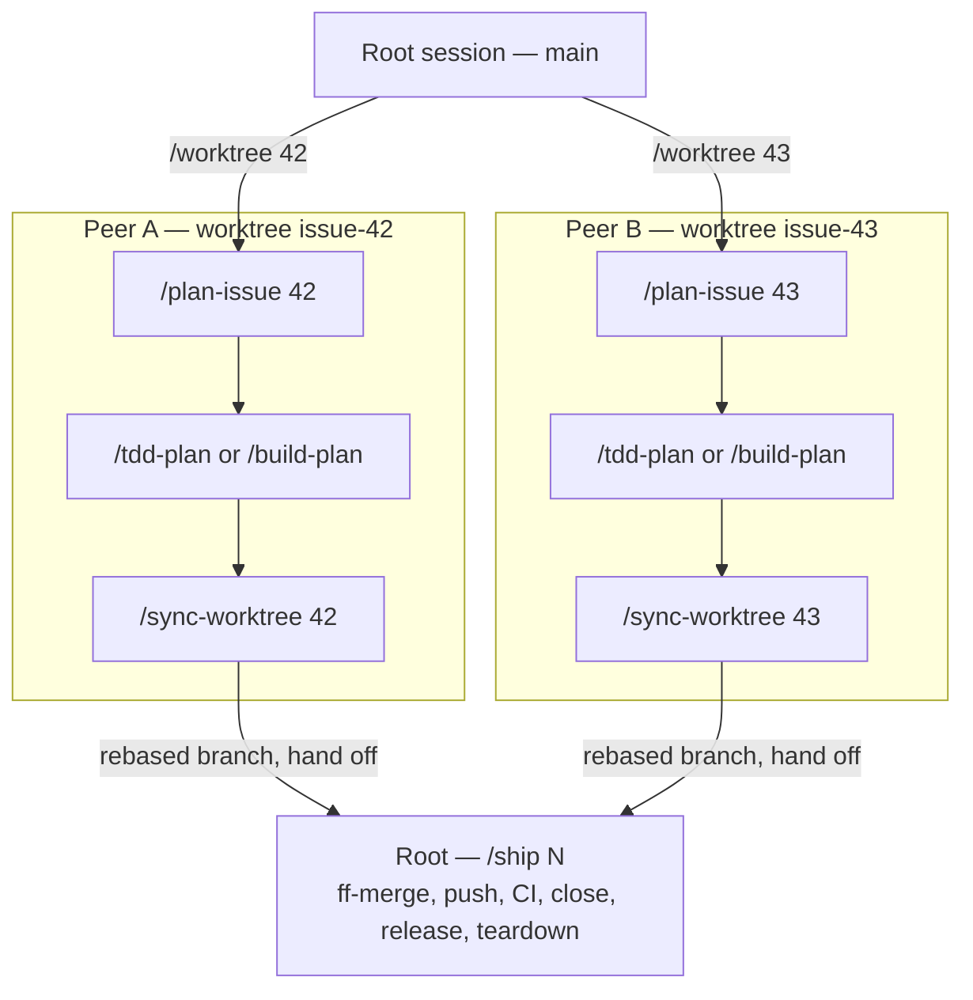
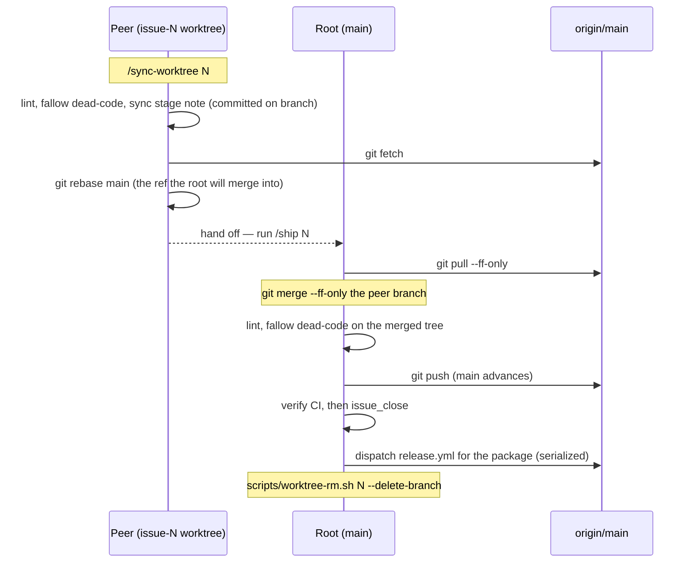

# pi-packages

A personal fork of [gotgenes/pi-packages](https://github.com/gotgenes/pi-packages), maintained at [haoliplus/pi-packages](https://github.com/haoliplus/pi-packages).
Thank you to Chris Lasher (gotgenes) and the upstream contributors for building and sharing these Pi extensions.
The permission system also descends from [MasuRii/pi-permission-system](https://github.com/MasuRii/pi-permission-system).
Original MIT licenses, copyright notices, and historical issue references are retained.

This fork uses the `@haoliplus/*` namespace and private workspace packages; no fork packages are currently published to npm.
Its initial focus is bounded read-only permissions and fewer repeated confirmation prompts.
See the [permission implementation plan](packages/pi-permission-system/docs/plans/fork-readonly-permissions.md) for scope and verification.

## Packages

| Package                                                                       | Description                                                                                                                                                                |
| ----------------------------------------------------------------------------- | -------------------------------------------------------------------------------------------------------------------------------------------------------------------------- |
| [@haoliplus/pi-autoformat](./packages/pi-autoformat/)                         | Pi extension package for prompt-end auto-formatting                                                                                                                        |
| [@haoliplus/pi-colgrep](./packages/pi-colgrep/)                               | Pi extension that integrates ColGrep semantic code search as an agent tool.                                                                                                |
| [@haoliplus/pi-github-tools](./packages/pi-github-tools/)                     | Pi extension providing deterministic GitHub CI, release, and issue tools.                                                                                                  |
| [@haoliplus/pi-nocd](./packages/pi-nocd/)                                     | Pi extension that injects the resolved working directory into the system prompt so the agent never cd-prefixes the current working directory                               |
| [@haoliplus/pi-permission-model-judge](./packages/pi-permission-model-judge/) | Deny-first typo-path model judge — a pi-permission-system Authorizer chain link                                                                                            |
| [@haoliplus/pi-permission-system](./packages/pi-permission-system/)           | Permission enforcement extension for the Pi coding agent.                                                                                                                  |
| [@haoliplus/pi-session-tools](./packages/pi-session-tools/)                   | Pi extension providing session metadata tools (naming, context) for multi-session workflows                                                                                |
| [@haoliplus/pi-subagents](./packages/pi-subagents/)                           | A focused, in-process sub-agent core for pi — autonomous agents plus a typed API and lifecycle events other extensions build on. Friendly fork of @tintinweb/pi-subagents. |
| [@haoliplus/pi-subagents-worktrees](./packages/pi-subagents-worktrees/)       | Git worktree isolation for @haoliplus/pi-subagents — a WorkspaceProvider that runs subagents in isolated worktrees.                                                        |

Each package has its own README with setup instructions, usage, and configuration details.

## Install

Clone the fork, install dependencies, and build its public type declarations:

```bash
git clone https://github.com/haoliplus/pi-packages.git
cd pi-packages
pnpm install --frozen-lockfile
pnpm run build:types
```

Install only the package you need from its absolute local path:

```bash
pi install /absolute/path/to/pi-packages/packages/pi-permission-system
```

## Uninstall

Remove the same local source:

```bash
pi remove /absolute/path/to/pi-packages/packages/pi-permission-system
```

Choose explicit packages; loading the entire development workspace also enables unrelated extensions.

## Contributing

See [CONTRIBUTING.md](./CONTRIBUTING.md) for the fork's contribution workflow.
Upstream issue links in retained design documents describe upstream history; they are not issues in this fork.
Release automation is disabled unless the repository explicitly sets `ENABLE_PACKAGE_RELEASES=true`; npm publication additionally requires removing the deliberate `private` flags and configuring fork-owned publishing.

## Development

### Prerequisites

- Node.js ≥ 22
- [pnpm](https://pnpm.io/) 11

### Setup

```bash
pnpm install
pnpm run build:types
```

This installs dependencies and wires the `prek` git hooks automatically via the `prepare` script.
The hooks include a `pre-commit` stage (a stray-invisible-character check, a Unicode-escape check for markdown prose and code comments, Biome, ESLint, rumdl) and a `commit-msg` stage that validates Conventional Commit headers via [committed](https://github.com/crate-ci/committed).

The invisible-character check rejects C0 control characters other than tab, line feed, and carriage return, plus DEL and the zero-width characters.
It deletes the two whose only correct repair is deletion (the zero-width space and the byte order mark) and reports the rest, because repairing those needs the surrounding sentence.
Run it directly with `node scripts/lint/invisible-characters.mjs [--fix] [paths...]`; with no paths it scans every tracked file.

The Unicode-escape check rejects a literal escape such as `\u2014` in the prose of a markdown file, outside code spans and fenced blocks, and a bare `u2014` token that lost its backslash.
In a JavaScript or TypeScript file it checks only the comments, so a string literal that spells an escape stays legitimate; a backtick-quoted escape inside a comment is exempt too.
Its `--fix` decodes each escape that spells a visible character and reports the rest for a hand repair.
Run it directly with `node scripts/lint/unicode-escapes.mjs [--fix] [paths...]`; with no paths it scans every tracked markdown and code file.

### Commands

```bash
pnpm run check    # typecheck all packages
pnpm run test     # test all packages
pnpm run lint     # biome + eslint + rumdl + invisible characters + unicode escapes
pnpm run lint:fix # auto-fix lint issues
```

### Reviewing changes per package

`scripts/hunk-pkg-diff.sh <package-name> [hunk-options...]` reviews the working-tree diff of a single package against its most recent release tag, scoped to that package's directory, using [Hunk](https://github.com/modem-dev/hunk).
It resolves the latest `<component>-v<version>` tag and runs `hunk diff <tag> -- packages/<package>`.

```bash
scripts/hunk-pkg-diff.sh pi-subagents
scripts/hunk-pkg-diff.sh pi-permission-system --mode split
```

The tag glob is `<package>-v*` (not `<package>-*`) so `pi-subagents` does not match the sibling `pi-subagents-worktrees` tags.

An equivalent command for [Diffview.nvim](https://github.com/sindrets/diffview.nvim) is defined in the project-local `.nvim.lua`, sourced by [`nvim-config-local`](https://github.com/klen/nvim-config-local) when Neovim is opened in this repo:

```vim
:PkgDiffview pi-subagents
:PkgDiffview pi-permission-system
```

### Agentic development workflow

Always start Pi from the **repo root**:

```bash
pi
```

This gives the agent access to:

- `.pi/settings.json` — loads all workspace packages from local source
- `.pi/prompts/` — slash commands (`/plan-improvements`, `/plan-issue`, `/tdd-plan`, `/ship`, etc.)
- Root `AGENTS.md` — monorepo-wide conventions

#### Standard workflow

Development is driven by slash commands.
A discovery command, `/plan-improvements`, updates a package's architecture document and opens GitHub Issues for the work it identifies.
Each issue is then taken through a manual loop until it ships.
In the standard workflow a single session works one issue at a time, committing directly to a linear `main`.



| Stage            | Command                      | What happens                                                                                              |
| ---------------- | ---------------------------- | --------------------------------------------------------------------------------------------------------- |
| 1. Discover      | `/plan-improvements`         | Updates a package's architecture document and creates GitHub Issues outlining the implementation work.    |
| 2. Plan          | `/plan-issue #N`             | Reads the issue, explores the codebase, produces a numbered plan, and commits it.                         |
| 3. Implement     | `/tdd-plan` or `/build-plan` | Executes the plan — TDD for code changes, build for docs/config. A pre-completion review runs at the end. |
| 4. Ship          | `/ship #N`                   | Pushes, verifies CI, closes the issue, and dispatches the release.                                        |
| 5. Retrospective | `/retro`                     | Reviews the session(s) for workflow improvements and persists retro notes.                                |

Each issue repeats stages 2–5.
Every stage can run in its own session; the prompt templates set a stage-encoded session name and write a `## Stage:` entry to a `docs/retro/NNNN-<slug>.md` file that bridges context across sessions.

#### Parallel worktree workflow

When two issues are independent — ideally in different packages — run them in parallel, each in its own git worktree and interactive Pi session off a short-lived branch.
`/worktree #N` (or `scripts/worktree-new.sh <issue>`) creates branch `issue-N-<slug>` off `origin/main`, checks out a worktree under `~/development/pi/pi-packages-worktrees/`, runs `pnpm install`, and opens a new terminal tab running `pi --approve "/plan-issue #N"`.
The peer session is born in its worktree (CWD set at spawn, never `cd`), so it has the full project config and never trips the `pi-permission-system` external-directory gate on its own files.
The launcher trusts the new worktree for both Pi (`--approve`) and `mise` (`mise trust`) — each tool gates trust by path, so a fresh worktree would otherwise block on a prompt or silently skip the `mise.toml` `[env]` PATH shims.

Each peer runs the same plan → implement loop as the standard workflow.
Shipping, though, is split across two sessions: `main` stays linear and has a single writer, so a peer cannot push to `main` directly.
The root half is the same `/ship #N` the standard workflow ends with — it detects a worktree lane from the presence of an `issue-N-*` branch and fast-forward-merges it, where a trunk ship has nothing to merge.



The convergence is a peer-to-root handoff.
The peer rebases its branch onto local `main` — the ref the root will merge into, which the shared `.git` makes visible — and the root fast-forward-merges it.
Because both sessions share one `.git`, the root sees the branch ref directly — the peer never pushes the branch or force-pushes anything.



| Stage            | Command                                      | Session | What happens                                                                                         |
| ---------------- | -------------------------------------------- | ------- | ---------------------------------------------------------------------------------------------------- |
| Launch           | `/worktree #N`                               | root    | Creates the branch + worktree, installs deps, opens a peer session running `/plan-issue #N`.         |
| Plan + implement | `/plan-issue` → `/tdd-plan` or `/build-plan` | peer    | The standard loop, inside the worktree.                                                              |
| Sync             | `/sync-worktree #N`                          | peer    | Lint + `fallow dead-code`, a sync stage note committed on the branch, then rebase onto local `main`. |
| Ship             | `/ship #N`                                   | root    | ff-merge into `main`, re-run the checks, push, verify CI, close the issue, release, and tear down.   |

Guardrails:

- One package per peer — two peers touching `pnpm-lock.yaml` or the same package's source is the main hazard.
- Release is the root's responsibility — peers never dispatch one, and a `release` concurrency group serializes runs anyway.
  A dispatch names its packages explicitly, so a deferral holds one package rather than all nine.
- Whoever lands second rebases first — if `/ship`'s ff-merge is rejected because `main` advanced, the peer re-runs `/sync-worktree #N` to rebase onto the new `main`, then the root retries.
- Tear down a worktree manually with `scripts/worktree-rm.sh <issue> [--delete-branch]`.

Package-specific context (architecture, priorities, testing strategy) lives in skills.
Load the relevant skill before working on a package:

- `package-pi-autoformat` — for `packages/pi-autoformat/`
- `package-pi-colgrep` — for `packages/pi-colgrep/`
- `package-pi-github-tools` — for `packages/pi-github-tools/`
- `package-pi-permission-system` — for `packages/pi-permission-system/`
- `package-pi-subagents` — for `packages/pi-subagents/`

The remaining packages (`pi-session-tools`, `pi-subagents-worktrees`, `pi-nocd`, `pi-permission-model-judge`) have no dedicated skill — their READMEs cover everything you need.

## License

MIT
