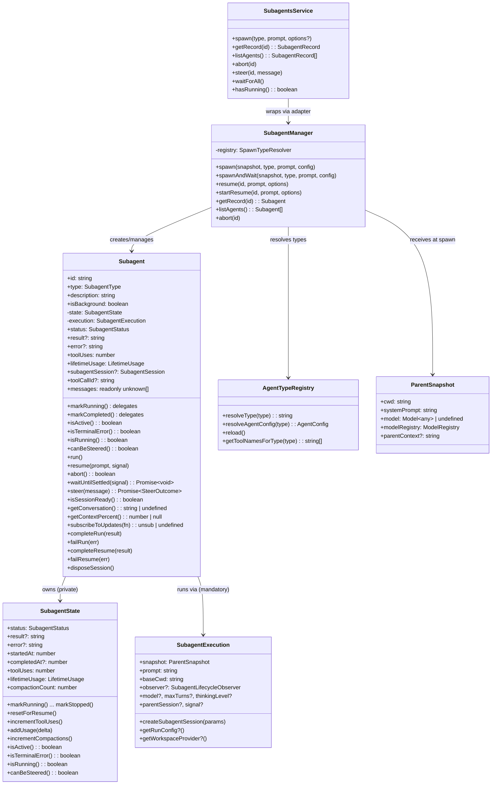
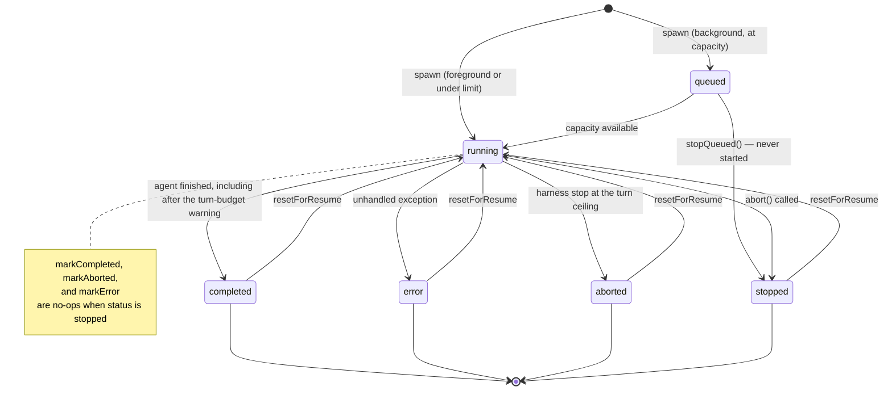
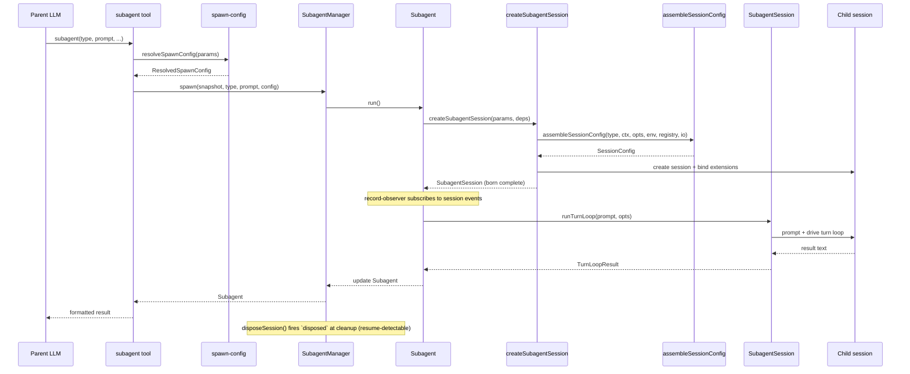
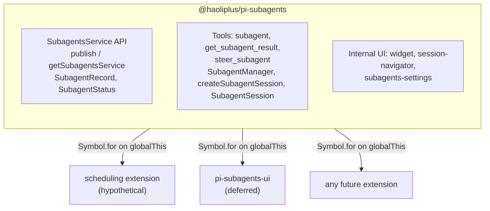
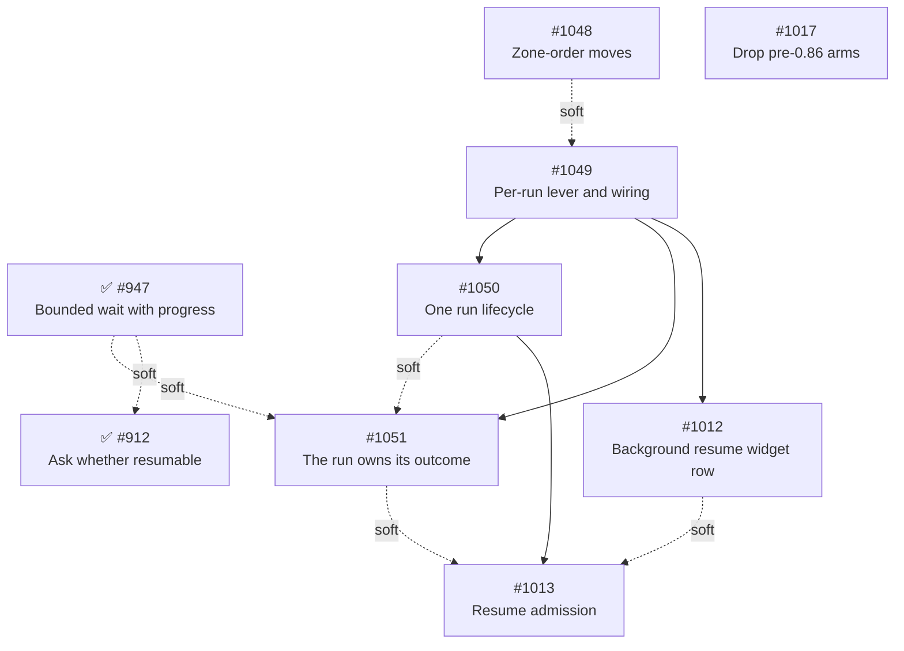

# Architecture

This document describes the architecture of the pi-subagents fork: a focused, composable core with a stable API boundary that other extensions can build on.

## Design principles

1. **Narrow core** — the extension owns agent spawning, execution, and result retrieval.
   Everything else is a consumer.
2. **Composable by default** — other extensions can spawn agents, observe their lifecycle, and display their state without importing this package directly.
3. **Typed API boundary** — this package exports a `SubagentsService` interface and `Symbol.for()` accessors (`publishSubagentsService` / `getSubagentsService`).
   Consumers declare this package as an optional peer dependency and use dynamic import for compile-time types.
   The runtime bridge is `Symbol.for("@haoliplus/pi-subagents:service")` on `globalThis` — no separate API package.
4. **No time-based scheduling** — cron-style timed dispatch (upstream's `schedule.ts` subsystem) is removed from the core (#52).
   Timed dispatch is a separate concern that any extension can implement by calling `spawn()` on the published API.
   The max-concurrent admission gate is not scheduling in this sense — concurrency management stays in core.
5. **UI is an in-core, substitutable consumer** — [ADR-0004](../decisions/0004-reconsider-ui-direction.md) records the per-component decision: the widget shrinks to background agents only, the bespoke conversation viewer is replaced by native session navigation, the `/agents` command is dissolved into focused surfaces, and the surviving UI stays in the core as a reactive consumer (not extracted to a separate package).
   Extraction remains an available future option because the composition invariant holds — the core is byte-for-byte identical with or without a given UI consumer.
6. **Snapshot, don't capture** — mutable parent state (ctx, session, model) is read once at spawn time and frozen into a `ParentSnapshot` data object.
   No live references survive past the spawn call.
7. **Subscribe, don't thread** — observation of agent progress uses direct session-event subscription, not callback parameters threaded through multiple layers.
8. **Construct complete** — objects are born with all their dependencies.
   If state isn't available yet, the object that needs it doesn't exist yet.
   No post-construction field writes from external code — if an object can't be instantiated ready-to-go, the prep work hasn't been done and the right dependencies haven't been identified.
9. **State owns its mutations** — mutable state lives in a class whose methods enforce valid transitions and invariants.
   Free functions that mutate module-scoped variables, closure-captured bags-of-functions, and external writes to shared interfaces are replaced by classes that encapsulate the state they manage.
10. **Open for extension, closed for modification** — pi-subagents is a minimal core that publishes events and a service API.
    Other packages (pi-permission-system, a future UI extension, hypothetical OTel integration) hook into these events to add permissions, rendering, or telemetry.
    Pi-subagents has zero knowledge of its consumers — dependency arrows point inward, never outward.

## Scope and non-goals

The README carries a short charter for the boundaries that come up most often.
This is the full inventory, with the decision record or design principle each rests on.

| Non-goal                                                                      | Rests on                                                                                             |
| ----------------------------------------------------------------------------- | ---------------------------------------------------------------------------------------------------- |
| Time-based scheduling (cron / interval / one-shot dispatch)                   | Design principle 4; `history/phase-2-remove-scheduling.md`                                           |
| Ad-hoc cross-extension event RPC (`subagents:rpc:*`)                          | Design principle 3; §"What the core dropped"                                                         |
| Group-join / consolidated completion notifications                            | §"What the core dropped"; `history/phase-3-remove-rpc-groupjoin.md`                                  |
| Model-scope enforcement (an `enabledModels` allowlist in the core)            | `docs/comparison-with-upstream.md` only — the weakest entry here                                     |
| Per-agent tool restriction policy (`disallowed_tools`, a built-in denylist)   | [ADR-0002](../decisions/0002-extensions-on-a-minimal-core.md); §"Child tool selection"               |
| Widening a child's tool allowlist with capability tools on the agent's behalf | §"Child tool selection"; operator position on the additive-key case                                  |
| A global run-mode default                                                     | Operator position; per-agent `run_in_background` already exists                                      |
| Worktree / environment isolation in the core                                  | [ADR-0002](../decisions/0002-extensions-on-a-minimal-core.md) §"What leaves the core"                |
| Persistent agent memory (`memory:`) and skill preloading (`skills:`)          | [ADR-0002](../decisions/0002-extensions-on-a-minimal-core.md); comparison doc                        |
| Per-agent extension lifecycle control (`isolated`, `extensions:`, `noSkills`) | [ADR-0002](../decisions/0002-extensions-on-a-minimal-core.md) and its amendment                      |
| New generative provider seams without a concrete consumer                     | [ADR-0002](../decisions/0002-extensions-on-a-minimal-core.md) §"The governing rule: no vacant hooks" |
| In-viewer steering or interactive child-session takeover                      | [ADR-0004](../decisions/0004-reconsider-ui-direction.md) Addendum criteria 1 and 2                   |
| Bespoke transcript rendering in the core                                      | [ADR-0004](../decisions/0004-reconsider-ui-direction.md) Decision B                                  |
| Agent-definition authoring UI (wizard, config editor, `/agents` menu)         | [ADR-0004](../decisions/0004-reconsider-ui-direction.md) Decision C                                  |
| Duplicating foreground progress in the above-editor widget                    | [ADR-0004](../decisions/0004-reconsider-ui-direction.md) Decision A                                  |
| Propagating the parent's `pi -e <path>` ephemeral extensions to children      | [ADR-0001](../decisions/0001-deferred-patches.md), now superseded — restate before citing            |

Extracting the surviving UI to a separate package is a **not now with criteria**, not a decline: [ADR-0004](../decisions/0004-reconsider-ui-direction.md) Decision D names the revisit conditions.

The following are **not** boundaries.
Pi's client-server split is a deferral pending an upstream capability (`docs/architecture/client-server-opportunities.md`), not a declined direction.
The parity status of the SDK `spawn()` path against the tool path, the stability guarantee carried by the lifecycle event payloads, parent-data redaction for SDK-spawned children, and ownership of `get_subagent_result` presentation are all unstated rather than settled.
`SubagentRecord`'s own guarantee is no longer among them: [decision 0005](../decisions/0005-subagent-record-admission-policy.md) settles what the public snapshot admits and which direction the contract runs.

The reimplement-don't-merge contribution pattern, applied across eight closed pull requests, is a repo-wide process rather than a scope boundary, and is documented in the repository's [contributing guide](https://github.com/haoliplus/pi-packages/blob/main/CONTRIBUTING.md).

## Domain model

The extension is organized around six domains, each responsible for one aspect of managing agents.

```mermaid
flowchart TB
    subgraph config["Config domain"]
        direction TB
        AgentTypeRegistry["AgentTypeRegistry<br/>(registry of agent types)"]
        DefaultAgents["default-agents<br/>(built-in types)"]
        CustomAgents["custom-agents<br/>(user .md files)"]
        InvocationConfig["invocation-config<br/>(per-call merge)"]
        ThinkingLevelModule["thinking-level<br/>(level vocabulary)"]
    end

    subgraph session["Session domain"]
        direction TB
        SessionConfig["assembleSessionConfig<br/>(pure assembler)"]
        Prompts["prompts<br/>(system prompt)"]
        Context["context<br/>(parent history)"]
        Env["env<br/>(git/platform)"]
        ModelResolver["model-resolver<br/>(fuzzy match)"]
        ProviderInheritance["provider-inheritance<br/>(replay parent providers)"]
    end

    subgraph lifecycle["Lifecycle domain"]
        direction TB
        SubagentManager["SubagentManager<br/>(spawn, abort, collection)"]
        ConcurrencyLimiter["ConcurrencyLimiter<br/>(thunk admission gate)"]
        CreateSubagentSession["createSubagentSession<br/>(assembly factory)"]
        SubagentSession["SubagentSession<br/>(turn loop, steer, dispose)"]
        Subagent["Subagent<br/>(status, behavior: abort/steer/run lifecycle)"]
        ParentSnapshot["ParentSnapshot<br/>(frozen parent state)"]
        Workspace["workspace<br/>(provider seam: child cwd + teardown)"]
    end

    subgraph observation["Observation domain"]
        direction TB
        RecordObserver["record-observer<br/>(stats + live activity via events)"]
        Notification["notification<br/>(completion nudges)"]
    end

    subgraph tools["Tools domain"]
        direction TB
        AgentTool["subagent tool<br/>(dispatch)"]
        ResultRenderer["result-renderer<br/>(pure rendering)"]
        SpawnConfig["spawn-config<br/>(resolve params)"]
        FgRunner["foreground-runner"]
        BgSpawner["background-spawner"]
        GetResult["get_subagent_result"]
        GetResultRenderer["get-result-renderer<br/>(pure rendering)"]
        Steer["steer_subagent"]
    end

    subgraph ui["UI domain"]
        direction TB
        Widget["agent-widget<br/>(live status)"]
        Sessions["session-navigator<br/>(session view)"]
        Settings["subagents-settings<br/>(settings command)"]
    end

    AgentTool --> SubagentManager
    SubagentManager --> Subagent
    Subagent --> CreateSubagentSession & SubagentSession
    CreateSubagentSession --> SubagentSession
    CreateSubagentSession --> SessionConfig
    SessionConfig --> AgentTypeRegistry
    SessionConfig --> Prompts & Env
    AgentTypeRegistry --> DefaultAgents & CustomAgents
    SpawnConfig --> InvocationConfig & ThinkingLevelModule
    CustomAgents --> ThinkingLevelModule
    RecordObserver -.->|subscribes| SubagentSession
    Widget -.->|polls| SubagentManager
    SubagentManager -.->|notifies| Widget
```



### Key domain types



## Agent lifecycle



A steer (`steer_subagent`, `SubagentsService.steer()`) redirects a running agent and changes no status.
The turn budget is not a status either: it is the live `turnBudget` (`{ used, maxTurns, phase }`) the turn loop reports to the record before the first turn and after each turn boundary.
A `TurnBudgetTracker` (`turn-limits.ts`) counts successful turns and decides when `SubagentSession` warns the child (a context-only custom message once `wrapUpTurns` turns remain, which forces no turn) and when it stops the run (after a ceiling turn that ran tools, or as a turn starts past the ceiling).
`phase` is `warned` once the warning went out and `exhausted` when the harness stopped the run: the one case `completeRun` and `completeResume` end `aborted`.
A resume runs a fresh tracker under the initial run's limits.

Note: `markStopped` always succeeds regardless of current status.
Other terminal transitions guard against overwriting `stopped` — once an agent is stopped, only `resetForResume` can return it to `running`.
`stopQueued` composes `markStopped` with a never-started marker and, like `completeRun`/`failRun`, notifies the lifecycle observer — so a queued stop publishes the same events, session entry, and nudge a running stop does.

## Execution flow



## Module organization

The extension's source files are organized into domain directories — `config/`, `session/`, `lifecycle/`, `observation/`, `service/`, `tools/`, `ui/`, and `handlers/` — plus a handful of root-level entry-point and shared modules.

Those directories are fallow boundary **zones** (`boundaries` in the repo-root `.fallowrc.json`), one zone per directory plus a `pi-subagents/core` zone for the root modules.
Each zone's `allow` list is the set of zones it imported when the zones were encoded, so the baseline reports zero violations and a **new** cross-zone edge is a finding (`boundary-violation`, severity `warn`, reported by `fallow dead-code` and `fallow audit` without failing either) and a `fallow decision-surface` `coupling-boundary` question in review.
Run `pnpm --silent fallow guard <file>` before adding a cross-directory import to see what the file's zone may import; when the new edge is intended, extend that zone's `allow` list in the same commit and say why in the commit body.

Two allowed edges run against the order those directories imply: `lifecycle/` imports `subscribeSubagentObserver` from `observation/` (`subagent.ts`), and `observation/` imports `display` and `glyphs` from `ui/` (`renderer.ts`).
The ratchet admits them because they predate it.
Neither should exist: `lifecycle/` is the core, `observation/` reacts to it, and `ui/` renders both.
Each is the only reason for its edge, and [#1048] moves the two modules to the directories that order puts them in.

### Current layout

```text
src/
├── index.ts                        entry point, tool registration, event wiring
├── runtime.ts                      SubagentRuntime factory (session-scoped state)
├── types.ts                        shared type definitions
├── persisted-record.ts             subagents:record session-entry contract (writer's builder, reader's parser)
├── settings.ts                     SettingsManager (persistent operational settings)
├── debug.ts                        debug logging utility
├── layered-settings.ts             loadLayeredSettings helper (published as @haoliplus/pi-subagents/settings)
│
├── config/                         agent type definitions and resolution
│   ├── agent-types.ts              AgentTypeRegistry class
│   ├── default-agents.ts           built-in agent configs (general-purpose, Explore, Plan)
│   ├── custom-agents.ts            user-defined agent .md file loader
│   ├── invocation-config.ts        per-call config merge (caller wins unless `locked`); background-mode resolution
│   └── thinking-level.ts           thinking-level vocabulary and parser, wider than pi-ai's `ThinkingLevel`
│
├── session/                        session assembly and preparation
│   ├── session-config.ts           pure assembler (main entry)
│   ├── prompts.ts                  system prompt building; inherits the parent prompt's identity, cutting the session-resolved tail (ADR 0006) and dropping Pi's `<tools>`/`<rules>` sections on the section-shaped prompt (ADR 0011) — and the project-context block too for a child running in its own directory (ADR 0010) — or its portable parts alone for a re-homing provider (ADR 0009)
│   ├── project-context.ts          Pi's `<project_context>` block, rendered in pi ≥0.86's shape; the loader a child whose adopted identity describes another directory resolves its own with (ADR 0010)
│   ├── ask-parent-tool.ts          child-facing ask_parent: records the child's question, tells it to end its turn
│   ├── builtin-extensions.ts       selects the Pi built-ins (codemode, tool-search, MCP) a child's allowlist calls for
│   ├── mcp-tool-patterns.ts        expands `mcp__…*` allowlist entries against the parent's registered tool names
│   ├── notify-parent-tool.ts       child-facing notify_parent: one-way mid-run update, capped at 2000 characters
│   ├── content-items.ts            shared message content parsing (tool-call names, assistant content)
│   ├── context.ts                  parent conversation extraction
│   ├── conversation.ts             render a session's messages as formatted text
│   ├── env.ts                      git/platform detection
│   ├── model-resolver.ts           fuzzy model name resolution
│   ├── package-exclusions.ts       child settings view that disables excluded packages' extensions
│   ├── provider-inheritance.ts     replays the parent's runtime-registered providers onto the child's own runtime, so the child inherits them without sharing the parent's mutable pool
│   └── session-dir.ts              session directory derivation
│
├── lifecycle/                      agent execution and state tracking
│   ├── subagent-manager.ts         collection manager + observer wiring + session-retention sweep (consumption-aware; an unanswered question holds the safety cap); the resume choke point, refusing from the record's own predicate and reporting a discriminated outcome, so every front door declines the same resumes; a door that returns before the resumed run ends starts one synchronously, and each resume's caller decides whether its outcome is claimed
│   ├── create-subagent-session.ts  assembly factory: MCP pattern expansion, Pi built-in selection, session creation, spawn-tool denylist, core child-tool install, binding
│   ├── subagent-session.ts         born-complete child session: turn loop, steer, shutdown-then-dispose teardown
│   ├── turn-limits.ts              turn-budget policy: TurnBudget, the TurnBudgetTracker that decides warnings and stops, normalizeMaxTurns (minimum 2)
│   ├── subagent.ts                 owns full execution lifecycle (run, resume, abort, steer, wait-until-settled); a teardown with no result text to carry its addendum records it as a notice and announces one produced after delivery; answers why a resume would be refused (resumeRefusal, including a live run), which the resume choke point and every result carrier read rather than re-deriving; reports a resume's start as well as its end; wait-until-settled reports whether the waited run settled, has not, or was replaced by a resume (carrying what it ended with)
│   ├── subagent-state.ts           lifecycle status + metrics + result-delivery value object (transitions, accumulators, classification predicates); delivery carries a revocable claim per carrier (each releases only its own handle), a one-way consumption latch, and a per-run update ledger that renders only what no announcement delivered; numbers its runs and keeps the outcome of the run the latest resume replaced
│   ├── run-listeners.ts            per-run observer-unsub and signal-detach handles
│   ├── workspace-bracket.ts        child workspace prepare/dispose lifecycle; idempotent dispose, reports a torn-down workspace
│   ├── concurrency-limiter.ts       background admission gate: schedules run thunks FIFO against the limit
│   ├── parent-snapshot.ts          immutable spawn-time parent state, including the parent's operator-authored prompt parts composed in Pi's own order
│   ├── child-lifecycle.ts          child-execution lifecycle event publisher
│   ├── child-shutdown.ts           bounded session_shutdown emit for a child being disposed
│   ├── workspace.ts                workspace provider seam (generative extension surface)
│   └── usage.ts                    token usage tracking
│
├── observation/                    progress tracking and notification
│   ├── record-observer.ts          session-event stats observer; stamps each event as the run's last progress
│   ├── notification.ts             completion nudges and mid-run updates, in one arrival-ordered withheld queue (announce-only; withheld during the parent's agent run and flushed on agent_settled, each re-checking its gates at emit rather than replaying them from enqueue — a completion on claim and consumption, an update on the claim and on the child still running, since a terminated run's updates ride its outcome and this nudge is one of their carriers), plus workspace notices, which are announced straight through
│   ├── outcome-delivery.ts         shared outcome rendering every result carrier composes: one status vocabulary in two presentations, body, and the addenda tail (mid-run updates, workspace notice, ask-back affordance — which names a resume only when the record says one would be accepted, and asks the parent to wait when the child has merely not settled) in one fixed order
│   ├── renderer.ts                 notification, mid-run-update, and workspace-notice TUI components
│   ├── composite-subagent-observer.ts fans manager notifications out to multiple observers; enumerates every member, so an optional one it omits is dropped silently
│   └── subagent-events-observer.ts manager lifecycle observer (event emission + persistence + notification)
│
├── service/                        cross-extension API boundary
│   ├── service.ts                  SubagentsService interface (spawn, query, abort, steer, resume, workspace seam) + Symbol.for() accessors
│   └── service-adapter.ts          SubagentsServiceAdapter class wrapping SubagentManager; maps live records to by-value snapshots at the boundary
│
├── tools/                          LLM-facing tool implementations
│   ├── agent-tool.ts               subagent tool definition, validation, dispatch
│   ├── result-renderer.ts          pure per-status result rendering
│   ├── spawn-config.ts             pure config resolution
│   ├── foreground-runner.ts        foreground execution loop
│   ├── background-spawner.ts       background spawn setup + the launch message every background door (spawn, resume) returns
│   ├── get-result-tool.ts          get_subagent_result tool; an optional timeout bounds a wait without stopping the agent; a wait a resume superseded reports the run it waited for
│   ├── get-result-report.ts        pure get_subagent_result report formatter
│   ├── get-result-renderer.ts      pure get_subagent_result line assembly for the collapsed and expanded TUI views
│   ├── steer-tool.ts               steer_subagent tool
│   └── helpers.ts                  shared tool utilities
│
├── ui/                             user-facing presentation
│   ├── agent-widget.ts             above-editor live status widget
│   ├── widget-renderer.ts          pure rendering for widget
│   ├── display.ts                  pure formatters and shared types
│   ├── bounded-lines.ts            component spending exactly one clipped terminal row per line
│   ├── labeled-rule.ts             full-width rule with embedded labels, Pi editor-border style
│   ├── glyphs.ts                   semantic display-glyph vocabulary (monospace-coverage constraint, #669)
│   ├── subagents-settings.ts       /subagents:settings command handler
│   ├── session-navigation.ts       pure session-selection and transcript-source logic
│   ├── session-navigator.ts        /subagents:sessions command handler
│   └── transcript-content.ts       transcript rows: per-message component blocks, width-cached (settles incrementally against Pi's state-before-listeners ordering, #689)
│
└── handlers/                       event handlers
    ├── index.ts                    barrel re-export
    ├── interrupt.ts                turn_start handler — abort all subagents on parent interrupt (ESC), when policy allows
    ├── lifecycle.ts                session_start, session_before_switch, session_shutdown
    └── widget-events.ts            widget's host events — session_start (UI context), turn_start (linger aging), session_shutdown (teardown)
```

### Observation model

Record statistics (tool uses, token usage, compaction counts) and live activity (active tools, response text) are updated by `record-observer.ts`, which subscribes directly to session events.
The turn budget is the exception: the turn loop owns the count it enforces, and reports each change to the record through its `onTurnBudget` option.
All run state still lives on the `Subagent` record.

The widget reads agent state by polling the records exposed via `SubagentManager.listAgents()` every 80 ms in fullscreen mode and every 250 ms in regular mode, where a frame's cost scales with the transcript; that poll loop is driven by the manager's lifecycle notifications (the widget subscribes as a `SubagentManagerObserver` fanned out through `CompositeSubagentObserver`), not by inbound calls from the spawn tools.
It runs if and only if a subagent is running, since a finished agent's line carries a fixed duration and the queued line is a count, so animating either would ask Pi to re-render its whole component tree for a byte-identical result.
The widget's rendered height is also bounded by the terminal's row count rather than a fixed ceiling: Pi's regular-mode differential renderer clears the screen and the scrollback whenever the first changed line sits above the previous viewport top, and the widget's spinner is that line on every tick, so a widget taller than the rows beneath it turns every tick into a destructive repaint ([#864]).
The `/subagents:sessions` navigator reads messages via `Subagent.agentMessages` and subscribes to updates via `Subagent.subscribeToUpdates()` — no direct `AgentSession` reference (#277).
It also reads the parent session's `subagents:record` entries (`persisted-record.ts`), so runs the manager no longer holds, such as those from before a `/reload`, open from their transcript file.

## Cross-extension architecture



Consumers call `getSubagentsService()?.spawn(...)` at runtime.
They declare this package as an optional peer dependency and use dynamic import for compile-time types.

### What the core owns

- The three tools: `subagent` (née `Agent`), `get_subagent_result`, `steer_subagent`.
- `SubagentManager` — spawn, abort, resume, collection management, observer wiring.
- `ConcurrencyLimiter` — background admission gate: schedules run thunks FIFO against a configurable concurrency limit.
- `createSubagentSession` — assembly factory: session creation and extension binding; returns a born-complete `SubagentSession`.
- `SubagentSession` — the born-complete child session: drives the turn loop (`runTurnLoop`/`resumeTurnLoop`), steers, and disposes (firing `disposed` at true session disposal, so resume executions are registry-detected).
- `child-lifecycle` — publishes the child-execution lifecycle (`spawning`, `session-created` before `bindExtensions()`, `bound` after it resolves, `completed`, `disposed`) on `pi.events`.
  Reactive consumers subscribe: `@haoliplus/pi-permission-system` registers each child session on `session-created`, audits it for a permission node of its own on `bound`, and unregisters it on `disposed`.
  This replaced the former outbound `permission-bridge` (#261, [ADR-0002]) — the core no longer looks up a named consumer.
- `workspace` — the single generative seam (#262, [ADR-0002]): a registered `WorkspaceProvider` supplies a child's cwd plus bracketed `dispose()` at run-start.
  With no provider, children run in the parent cwd (default unchanged); the git worktree strategy lives behind this seam in `@haoliplus/pi-subagents-worktrees` (#263, the seam's first consumer).
- `session-config` — pure configuration assembler (called by `createSubagentSession`).
- `SubagentRuntime` — session-scoped state bag with methods.
- `ParentSnapshot` — immutable snapshot of parent session state, captured once at spawn time.
- `record-observer` — session-event observer that updates record statistics without callback threading.
- Agent type registry — default agents, custom `.md` file loading.
- Prompt assembly, context extraction, skills, environment.
- Worktree isolation — evicted to `@haoliplus/pi-subagents-worktrees` via the workspace provider seam in Phase 16 (#263, [ADR-0002]); `git` no longer appears in the core.
- Token usage tracking.
- Session directory derivation and persisted `SessionManager` for subagent transcripts.
- Settings persistence.
- Internal UI (widget, `/subagents:sessions` session navigator, `/subagents:settings` command) — the conversation viewer and `/agents` menu were removed in Phase 19 (Steps 5–6, [#442], [#441]) per [ADR-0004].

### Child tool selection

A child's **capability** tool set is exactly its agent type's `tools:` list, which `createSubagentSession` hands to the SDK as the session's tool allowlist.
Pi applies that allowlist _before_ it builds the session's tool registry, so an extension loaded in the child registers its tools successfully and they are then filtered out unless the agent named them.
Naming an extension tool in `tools:` is therefore the supported way to give a child access to it, and the documented one ([Configuration](../configuration.md#tool-selection)).

The core does not widen that on the agent's behalf, and no settings key may name a tool.
Inheriting every extension tool a child registers would hand a read-only agent whatever write-capable tools the parent's extensions happen to publish — a capability decision that belongs to whoever writes the agent file, expressed per agent, not a default.
Tool _restriction_ beyond that stays with `@haoliplus/pi-permission-system`, per [ADR-0002].

Pi supplies `codemode`, `tool_search`, and MCP tools through built-in extensions it hands only to its own CLI session, so `createSubagentSession` hands them to the child's loader itself, and only those the allowlist calls for (`builtin-extensions.ts`).
They go in as `builtin: true, replaceable: true` entries under Pi's own names, so the operator's `-builtin:<name>` setting and Pi's replacement rule apply to children as they do to the parent.
Selecting by allowlist rather than inheriting the parent's set keeps MCP, which connects every configured server when it loads, out of every child that cannot reach an MCP tool.

An allowlist entry starting with `mcp__` and containing `*` is a pattern (`mcp__github__*`), expanded at child creation against the tool names the parent has registered (`mcp-tool-patterns.ts`, fed by the composition root's `listParentToolNames`).
Pi's allowlist matches names exactly and an MCP server's names exist only once it connects, so the parent's registry is the one place a whole server can be named from; the agent still writes the pattern, so this does not widen the allowlist on its behalf.

The core does install its own **protocol** in every child, on its own authority and independent of the agent file: the `<active_agent>` tag, the parent-context prefix, and the `ask_parent` / `notify_parent` tools.
The distinction the boundary draws is capability, not provenance.
None of these reaches the filesystem, the shell, or the network — each can only put text into the session that spawned the child — so a read-only agent that gains them is still read-only, and the two failure modes that closed PR #612 (a read-only `Explore` silently gaining `edit`/`write`; `subagent` re-entering the allowlist and reopening the recursion guard) remain refused.
A child-facing tool is appended to the allowlist at the assembly factory rather than drawn from it, because Pi filters `customTools` through the same allowlist and would otherwise drop it with no error.

The recursion guard is the one name set the core removes unconditionally.
It reaches the SDK as the `excludeTools` denylist, which Pi reapplies on every tool-registry rebuild; filtering the active set once after `bindExtensions` was undone by the next rebuild.

### What the core dropped

- **Scheduling** (`schedule.ts`, `schedule-store.ts`, `ui/schedule-menu.ts`) — removed (#52).
- **Ad-hoc RPC** (`cross-extension-rpc.ts`) — replaced by the typed `SubagentsService` published via `Symbol.for()` (#49).
- **Group join** (`group-join.ts`) — removed (#49).
- **Output file** (`output-file.ts`) — replaced by `session-dir.ts` + `SessionManager.create()` (#61).
- **Callback threading** — the three-layer `on*` callback chain was replaced by direct session-event subscriptions (#100).
- **Live `ctx` capture** — replaced by `ParentSnapshot`, an immutable data object captured once at spawn time (#99).

## SubagentsService

The `SubagentsService` interface, accessor functions, and serializable types are exported from `@haoliplus/pi-subagents` via the `./service` export map entry.
No separate API package is needed.

Consumers declare this package as an optional peer dependency:

```json
{
  "peerDependencies": {
    "@haoliplus/pi-subagents": ">=5.0.0"
  },
  "peerDependenciesMeta": {
    "@haoliplus/pi-subagents": { "optional": true }
  }
}
```

At runtime, consumers use dynamic import for type-safe access to the accessor functions:

```typescript
const { getSubagentsService } = await import("@haoliplus/pi-subagents");
const svc = getSubagentsService();
if (svc) {
  svc.spawn("Explore", "Check for stale TODOs");
}
```

Pi's extension loader creates a fresh `jiti` instance per extension with `moduleCache: false`, so module-scoped singletons don't survive across extensions.
The accessor functions use `Symbol.for("@haoliplus/pi-subagents:service")` on `globalThis`, which is process-global by spec, to bridge this gap.
The dynamic import provides compile-time types; the `Symbol.for()` key is the actual runtime channel.

### Interface

See `src/service/service.ts` for the canonical definition.
Key types:

- `SubagentsService` — `spawn`, `getRecord`, `listAgents`, `abort`, `steer`, `resume`, `waitForAll`, `hasRunning`.
- `ResumeOptions` — `claimOutcome`, `signal`; `ResumeResult` — the resumed snapshot or a `ResumeRefusalReason`.
- `SubagentRecord` — serializable by-value agent snapshot; admission policy in [decision 0005](../decisions/0005-subagent-record-admission-policy.md).
- `SpawnOptions` — `description`, `model`, `maxTurns`, `thinkingLevel`, `inheritContext`, `foreground`, `bypassQueue`.
- `SUBAGENT_EVENTS` — channel constants for `pi.events` subscriptions.

### Accessor pattern

```typescript
const SERVICE_KEY = Symbol.for("@haoliplus/pi-subagents:service");

export function publishSubagentsService(service: SubagentsService): void {
  (globalThis as Record<symbol, unknown>)[SERVICE_KEY] = service;
}

export function getSubagentsService(): SubagentsService | undefined {
  return (globalThis as Record<symbol, unknown>)[SERVICE_KEY] as
    | SubagentsService
    | undefined;
}
```

If Pi gains a native service registry ([earendil-works/pi#4207]), these accessors can be updated to delegate to `pi.registerService()` / `pi.getService()` internally while keeping the same consumer API.

### Lifecycle events

The core emits events on `pi.events` that any extension can observe:

| Channel               | Payload                                                                                          | When                                                                                      |
| --------------------- | ------------------------------------------------------------------------------------------------ | ----------------------------------------------------------------------------------------- |
| `subagents:started`   | `{ id, type, description }`                                                                      | Agent begins running                                                                      |
| `subagents:completed` | `{ id, type, description, status, turnBudget?, result?, error?, toolUses, durationMs, tokens? }` | Agent finishes successfully                                                               |
| `subagents:failed`    | same as `completed` (`buildEventData` shape)                                                     | Agent ends in `error`/`stopped`/`aborted`                                                 |
| `subagents:resuming`  | `{ id, type, description }`                                                                      | A resume starts, from either front door                                                   |
| `subagents:resumed`   | same as `completed` (`buildEventData` shape)                                                     | Resumed run reaches a terminal state (`completed`/`error`); `status`/`error` discriminate |
| `subagents:compacted` | `{ id, type, description, reason, tokensBefore, compactionCount }`                               | Child session compacts                                                                    |
| `subagents:created`   | `{ id, type, description, isBackground }`                                                        | Background agent created (pre-admission)                                                  |
| `subagents:steered`   | `{ id, message }`                                                                                | Steering message delivered to a running agent                                             |

These are fire-and-forget broadcast events — no request IDs, no reply channels.

## Architecture direction

pi-subagents **is** a minimal orchestrator with inverted dependencies.
The core spawns a child session derived from the parent, runs the turn loop, tracks and streams and collects the result, gates concurrency, supports resume, and **publishes its lifecycle**.
Everything else — permissions, worktree/workspace isolation, UI, telemetry — is an extension that attaches through one of two surfaces and never reaches into the core.
This inversion landed across Phases 14, 16, 18, and 19; the sections below describe the resulting boundary and the deeper direction still being sharpened.

The rationale and the full reasoning chain that led here are recorded in [`docs/decisions/0002-extensions-on-a-minimal-core.md`](../decisions/0002-extensions-on-a-minimal-core.md).

A separate, longer-horizon note — [`client-server-opportunities.md`](./client-server-opportunities.md) — records what Pi's eventual client-server split (Mario Zechner's session-sync unification) would unlock for pi-subagents: viewing live subagent sessions, viewing suspended ones, and operators interacting with a subagent through an editor.
That architecture is not on the near-term roadmap; the note captures the opportunity so it is on record.

### Two extension surfaces

Extensions attach through exactly two surfaces, distinguished by the direction of information flow.

1. **Lifecycle events (observational) — unlimited.**
   The core emits awaited, ordered events for the child-execution lifecycle (`spawning`, `session-created` pre-`bindExtensions`, `bound` post-`bindExtensions`, `completed`, `disposed`).
   Any number of extensions subscribe; handlers return nothing.
   Reactive concerns live here: permission detection, telemetry, UI, notifications.
   Adding a reactive concern never modifies the core.
2. **Provider seams (generative) — rationed.**
   The rare concern that must _inject_ a value the core consumes synchronously registers a provider the core consults.
   Today there is exactly one: the **workspace provider** (returns the child's working directory plus bracketed setup/teardown).
   A provider seam is the only place the core is "open," so the list is kept as small as possible.

The discriminator when deciding how a concern attaches:

- It only needs to **know** what happened → subscribe to a lifecycle event (observational, unlimited).
- It must **return a value the core consumes** → register a provider (generative, rationed).

The governing rule — **no vacant hooks**: the architecture must _admit_ a seam without _shipping_ it until a concrete consumer exists.
A provider seam with no consumer is a speculative abstraction that taxes every reader and that `fallow` flags as dead.
Latent extensibility is the deliverable; a vacant hook is not.

The [first-principles refinement](#first-principles-refinement-and-the-deeper-target) below sharpens this two-surface split.
The awaited, behavior-affecting lifecycle events (notably `session-created` before `bindExtensions`) are _hooks_ — the child's own extension surface applied recursively, generative because the core waits on the handler before deciding what to do next.
The observational surface then carries only fire-and-forget broadcasts of immutable snapshots, which no consumer can use to change the core.

### Core responsibilities (keep)

- **Agent definitions** — name, model, thinking, system prompt, tools list.
- **Prompt composition** — system prompt assembly.
- **Session lifecycle** — create child sessions, bind extensions, run conversation loop, track results.
- **Concurrency management** — queue, abort, resume, max concurrency.
- **Recursion guard** — remove pi-subagents' own three tools from child sessions (prevent infinite nesting).
  With `isolated` removed (#264), the guard is unconditional for every child that reaches binding, rather than gated on `cfg.extensions`.
  This is the core defending its own invariant, keyed off its own tool names — not policy.
- **Package-extension exclusion** — filter the child's package view by the `excludedExtensionPackages` setting before resource loading, so an excluded package's extensions are never imported in children (#696).
  Resolved at the composition root; the assembly factory receives a ready-made settings view and holds no policy.
- **Lifecycle events** — emit awaited, ordered events when child sessions spawn, are created, complete, and are disposed.
- **Workspace provider seam** — accept a registered `WorkspaceProvider` and consult it for the child's cwd; default to the parent's cwd when none is registered.
- **Service API** — publish `SubagentsService` via `Symbol.for()` for cross-extension access.

### Responsibilities removed from the core

These policy and environment concerns were removed so the core stays narrow; each now lives in a consumer or behind the workspace seam:

- **Tool policy** (`disallowed_tools`) and **extension filtering** (`extensions: string[]`) — access control and tool visibility belong in pi-permission-system's `permission:` frontmatter (Phase 14, #237/#238).
- **Worktree isolation** (`GitWorktreeManager`, the `isolation: "worktree"` mode) — one _strategy_ for choosing the child's cwd, evicted to `@haoliplus/pi-subagents-worktrees` (#263), the first consumer of the workspace provider seam.
- **Per-agent extension lifecycle control** (`extensions: false`, `isolated`, `noSkills`) — removed in #264; deny-at-use covers what `isolated` pretended to do for tools.
  Prevent-load ships instead as the global/project `excludedExtensionPackages` setting (#696): a provider seam was declined because no _extension_ wants to supply the policy, which would make the seam a vacant hook.

### Composition model

In the target state, pi-subagents publishes events and a provider seam; other packages hook in:

- **pi-permission-system** (observational) subscribes to child-session lifecycle events, detects subagent execution context in the child, and gates tool calls at runtime.
- **pi-subagents-worktrees** (generative) registers a `WorkspaceProvider` that prepares a git worktree at run-start and tears it down after, supplying the child's cwd.
- **pi-subagents-ui** (future, under reconsideration — see the [first-principles refinement](#first-principles-refinement-and-the-deeper-target)) subscribes to the broadcast and the query/behavior interfaces; the conversation viewer and `/agents` menu were removed in Phase 19 per [ADR-0004]; the surviving UI (widget, session navigator, settings command) stays in-core.
- **Any future extension** (OTel, auditing, cost tracking) subscribes to the same events without pi-subagents knowing.

Composition test: install neither extension, only permissions, only workspaces, or both — the core is byte-for-byte identical in all four cases, and the two extensions never reference each other.

This is achieved across phases: Phase 14 (strip policy), Phase 16 (invert dependencies — extensions on a minimal core), and Phase 18 (reconsider UI).

### First-principles refinement and the deeper target

The two-surface model above is correct but coarse.
Pushing it against our own principles — construct complete, state owns its mutations, tell-don't-ask, dependency inversion — surfaces sharper boundaries that the current code draws through the middle of classes.
This subsection records the deeper target; the steps that realize it are sequenced in later phases.

#### `Subagent` is four conflated domains

The construction duality that motivates Phase 17 — a class that is simultaneously a passive record and an executor — is only the two most visible of four domains fused into one class.
Pulling each apart by asking "who changes this, how often, and who needs to know" surfaces:

1. **Lifecycle state** — status, result, error, timestamps.
   Owned by the subagent; transitions are rare and meaningful; the right outward shape is an immutable snapshot announced on change.
2. **Metrics** — tool uses, token usage, compaction count.
   These are not lifecycle state; they are a projection aggregated over the child session's event stream.
   `record-observer` already computes them — its only error is writing the aggregate back onto the subagent.
3. **The hook surface** — the points where an extension alters or augments the child before and around its run.
   This is the child session's own extension binding (see below), not data on the subagent.
4. **Result delivery** — whether the parent has consumed the result, when to nudge, how the result reaches the caller.
   This domain now has a home: `consumedAt` is a first-class field on `SubagentState`, marked only at the parent-initiated return edges (`get_subagent_result`, foreground return, resume return); the notification layer reads it to suppress a nudge but never owns it, and the retention sweep reads it to time session release (#617).

The ~20 optional constructor fields and the runtime `run()` throws are the pressure these four domains exert on one class.
Separating them is what makes the Phase 17 steps fall out rather than fight back.

#### A subagent is a sequence of runs

The four domains above describe one run, and a subagent has several: the initial run, then one per resume, each continuing the session the previous one left.
What belongs to a run is a fact about that run, not about the agent: its abort lever and the signal wired to it, its session subscription, its turn budget, its mid-run update ledger, its outcome and whether a carrier claimed or consumed it, its mode (foreground or background), and its admission through the concurrency gate.
What belongs to the agent outlives every run: identity, the child session, the workspace, and the lifetime metrics.

The code does not draw this boundary yet.
Per-run facts live as fields on the per-agent record and are cleared by hand where a run begins (`resetForResume`), and "initial or resume" is re-decided in parallel method pairs at the session, record, and observer layers.
The tells are the bug family of a lever set at one lifecycle edge and read at another ([#913], [#949]) and a method pair that has already diverged.

The target: the record holds its current run, a resume starts a new run instead of resetting the old one, a waiter holds the run it waited on, and the run's kind is a property of the run, decided once where it is published (`subagents:completed` versus `subagents:resumed`) rather than in every layer.

#### The subagent is a recursive Pi

A subagent is a child Pi session: created with `createAgentSession`, then `bindExtensions`.
Its extension surface is therefore Pi's extension surface applied recursively — not a bespoke event bus.
What the current doc calls "awaited, ordered lifecycle events" are not observations; they are **hooks**, structurally identical to Pi's own (`session_start`, `tool_execution_start`).
The tell is the awaiting: the core waits for the handler because the handler's completion changes what the core does next — an extension registers before the child binds.
A handler that can change subsequent behavior is generative, not observational, whatever we name the channel.

This splits the current "lifecycle events" surface cleanly in two:

1. **Broadcast** (observational, fire-and-forget) — "this happened; react if you want; you cannot change anything."
   Carries immutable snapshots for telemetry, notification, and any renderer.
   No consumer holds a live `Subagent`.
2. **Hooks** (generative, awaited, ordered) — the recursive Pi extension surface where workspace, permissions, and future concerns attach to the child.
   The `WorkspaceProvider` is one _typed_ hook; the general form is "be an extension of the child session."

The "no vacant hooks" rule still governs the generative side: admit the surface, ship a hook only when a real consumer exists.

#### Reactive versus discrete (not internal versus external)

The axis that decides push versus pull is whether a need is reactive or discrete — never whether the consumer is in-package or out.

- **Reactive** (ambient state that changes underneath you) → subscribe to the broadcast; be told.
  The state-owner announces; the consumer maintains its own read-model; nobody pulls.
- **Discrete** (a one-shot question: current value, full transcript) → pull a query.
  `get_subagent_result`, opening a transcript, and the external `SubagentsService.getRecord` are queries by nature and stay pull, in-package or not.

Behavior is a third interface: **tell by id, with outcomes**.
`steer` and `abort` own their own rules — a non-running agent rejects a steer from inside `steer`, not via a caller's status pre-check — so coordinators never ask-then-tell.

#### Consequences

Two consequences fell straight out, and both cut scope — both have since landed.

1. **The activity/metrics push tier was provisional and is gone.**
   Its only reactive consumer was the inherited widget; treated from first principles, metrics are accumulated by an observer, exposed as a discrete query, and folded into the completion snapshot.
   Phase 18 deleted `AgentActivityTracker` and `ui-observer` and made the widget a pure reactive consumer of lifecycle events — the high-frequency stream did not need to exist.
2. **Phase 18 was "reconsider the UI," not "extract the UI."**
   The widget and `/agents` menu predated the fork; they were consumers judged on our principles, not requirements to preserve.
   [ADR-0004] recorded the per-component verdict and Phase 19 implemented it: the widget shrank to background agents, the bespoke viewer and `/agents` menu were removed, and the surviving UI stays in-core as a reactive consumer.

#### Sibling packages follow the same discipline

`@haoliplus/pi-permission-system` is one of these hooks, and it is subject to the same scrutiny.
Its boundaries deserve the same first-principles treatment: surface its conflated domains, distinguish what it observes from what it injects, and prefer being told over asking.
The recursion principle means a consumer's internal design is not exempt because it lives in another package — the same axes (reactive versus discrete, hook versus broadcast, construct complete) apply across the seam.

#### How we find these boundaries

The boundaries above were not deduced top-down; they were surfaced by friction.
Each place the target got _harder_ to test marked a domain seam drawn through the middle of a class.
That method — testability friction as a boundary probe, with its limits — is recorded in the `improvement-discovery` skill so it outlives this phase.

## Current structural analysis

### Health metrics

| Metric                     | Value                                                                   |
| -------------------------- | ----------------------------------------------------------------------- |
| Health score               | 78/100 (B), end of Phase 22                                             |
| Total LOC                  | 11,048 (69 files)                                                       |
| Dead code                  | 0 files, 0 exports                                                      |
| Maintainability index      | 91.2 (good)                                                             |
| Avg cyclomatic complexity  | 1.3                                                                     |
| P90 cyclomatic complexity  | 2                                                                       |
| Production duplication     | 0 lines                                                                 |
| Test duplication           | retired (fallow 3.2.0 excludes test files; see Phase 20 Step 9 history) |
| Fallow refactoring targets | 0                                                                       |

Recompute `Total LOC` with `find src -name '*.ts' | wc -l` and `cat $(find src -name '*.ts') | wc -l` — it counts `src/` only, so `fallow health`'s package-wide total is the wrong source.
Every other row is a `fallow health` field.
The values as of the last phase close are also committed as a machine-readable snapshot at `docs/fallow-snapshot.json`, written by `pnpm --silent fallow health --save-snapshot packages/pi-subagents/docs/fallow-snapshot.json --workspace @haoliplus/pi-subagents`; `fallow health --trend` reads it for per-metric deltas.

### Dependency bag inventory

The 10+-field dependency bags flagged in prior phases (`ResolvedSpawnConfig`, `AgentSpawnConfig`, `RunOptions`, `SessionConfig`, `SubagentSessionIO`, `SubagentExecution`) were all decomposed into focused value objects; the remaining wide interfaces (`NotificationDetails`, `ResourceLoaderOptions`, `CreateSessionOptions`) are DTO/SDK-boundary types accepted as-is.

### Complexity hotspots

Functions with cyclomatic complexity ≥ 21 (critical threshold):

No functions remain above the critical threshold — all hotspots resolved in Phase 12. 1 function remains at HIGH severity (a test helper, `subagent-manager.test.ts`'s `createManager`); 14 at moderate.
No `src/` function reaches HIGH severity or CRAP ≥ 60 (Phase 20 target met).

### Churn hotspots

Files with highest commit frequency × complexity:

| Score | File                         | Commits | Trend     |
| ----- | ---------------------------- | ------- | --------- |
| 52.1  | `lifecycle/subagent.ts`      | 64      | ─ stable  |
| 41.9  | `index.ts`                   | 127     | ▼ cooling |
| 22.7  | `ui/agent-widget.ts`         | 38      | ▼ cooling |
| 21.3  | `tools/agent-tool.ts`        | 80      | ▼ cooling |
| 19.7  | `service/service-adapter.ts` | 27      | ▼ cooling |
| 17.6  | `tools/foreground-runner.ts` | 38      | ▼ cooling |

Values as of Phase 23 planning (2026-10-09).
`lifecycle/subagent.ts` overtook `index.ts` after Phase 22 closed, its score rising from 39.9 to 52.1 across the resume and turn-budget work that followed; `lifecycle/subagent-state.ts` (17.3) and `lifecycle/subagent-manager.ts` (16.3), just below the top six, are the two accelerating `src/` files.

### Production duplication

Production duplication is 13 lines in one clone group: `SubagentSession.runTurnLoop` and `resumeTurnLoop` (`lifecycle/subagent-session.ts`), the session layer's half of the initial-or-resume fork [#1050] collapses.

## Improvement roadmap — Phase 23: Runs as first-class

### Findings (planned 2026-10-09)

Phase 22's Findings declared the next spine: what a consumer may learn about a running child ([#947], [#912], and [#755], since closed).
Discovery put that candidate to the operator beside a cause it found underneath the package's hottest file, and the operator took both: the run as the phase's cause, the declared candidate as a parallel track.

The cause is that **a run is not a first-class concept**.
A subagent is a sequence of runs (the initial run, then one per resume), but everything that belongs to one run lives as a field on the per-agent record: the abort controller, the signal wiring, the session subscription, the turn budget, the update ledger, the outcome with its claims and consumption, the mode, and the admission.
`resetForResume` clears eight fields by hand to start the next run, a one-slot `_superseded` buffer stands in for the run a waiter waited on, and "initial or resume" is re-decided in parallel method pairs at three layers: `runTurnLoop`/`resumeTurnLoop`, `run`/`runResume`, `completeRun`/`completeResume`, `failRun`/`failResume`, `onStarted`/`onResumeStarted`, and `onRunFinished`/`onResumeFinished`.
It traces to the first-principles section's "`Subagent` is four conflated domains": those four describe one run, and the refinement the steps realize is recorded there as "A subagent is a sequence of runs".

The evidence, each item measured or read during planning:

- The pairs have diverged.
  `completeRun` tears down the workspace of a run that wrapped up at its turn limit while asking a question; `completeResume` holds it, and no test covers the resume side.
  The craftsmanship scout found the same divergence independently.
- Three open issues are the cause seen from outside: [#1012] (an agent spawned in the foreground and resumed in the background has no widget row, because `isBackground` is fixed at spawn), [#1013] (a background resume bypasses `maxConcurrent`, and the issue names the missing "queued-for-resume state"), and [#949] (a signal that has already fired never cancels its run).
  [#949] is the last open member of Phase 22's bug family of a lever set at one lifecycle edge and read at another.
- Method-level fixes were considered twice and correctly declined.
  [#913]'s assessor rejected a shared `beginRun` helper because the two sequences do not line up, and [#857]'s left the `holdForResume` predicate inline "unless a third site appears"; the two sites diverged first.
  The fix is a lifecycle object, not an extracted method.

Fallow corroborates as symptoms (2026-10-09): health 78 (B), unchanged, with 0 dead code and 0 refactoring targets.
Two vital signs moved since the Phase 22 snapshot, both on the cause.
Production duplication went from 0 to 13 lines in one clone group (`runTurnLoop`/`resumeTurnLoop`), and the hotspot count from 0 to 1: `lifecycle/subagent.ts` (833 lines) rose from 39.9 to 52.1 and overtook `index.ts`, with 12 of its 64 commits landing after the Phase 22 archive.
Real coverage (Istanbul) puts every `src/` file under CRAP 30 except `tools/agent-tool.ts` (42.0), which is unchanged since Phase 20 and not this phase's cause.
The repeated-discriminator sweep found no new family: `this._status !== "stopped"` sits inside its owning object, `raw !== "object"` is a validation edge, `mode === "fullscreen"` is per-consumer presentation, and the `.type === "text"` and `role === "assistant"` sites parse different SDK shapes.
Fallow cannot see the run-kind fork itself, which is spelled as method names rather than comparisons; the 16-name count below is its detector.

The craftsmanship scout refuted all five fallow large-function flags on test files: `subagent-manager.test.ts:158`, `prompts.test.ts:48` and `:387`, `settings.test.ts:352`, and `notification.test.ts:234` are each a nested tree of behavior-named tests, the longest `it` about 67 lines.
It found one concentrated cluster, in the hot file: `test/lifecycle/subagent.test.ts` against `src/lifecycle/subagent.ts`'s run/resume pair.
The cluster holds the divergence above, the missing resume-side test, 19 `mock.calls[N]` reads (12 of them the factory's `askParent`/`notifyParent` channels), duplicated `runWithWorkspace`/`runAsking` arranges, 36 flat top-level `describe` blocks, and four terminal methods public only for tests.
That cluster rides [#1050]; everything else the scout found is scattered and stays on the boy-scout path (listed below).

Directory check: skipped, since `src/` holds 7 root files and every module this phase touches has a home.
The per-run object lands in `src/lifecycle/subagent-run.ts`, and [#1048] moves the two modules that cross the zone order backwards.

Feasibility: [#1017]'s precondition is met.
The peer floor is `>=1.0.0` for all three Pi packages, and Pi 1.0.0's `buildSystemPromptSections` (the installed `dist/core/system-prompt.js`) renders only the section shape, so no `Current working directory:` footer reaches a child.
No other step depends on an SDK surface.

Trajectory: the maximum step priority ran 15 (Phase 20), 16 (Phase 21), 16 (Phase 22), and 16 here ([#947]), and the top hotspot is heating rather than cooling, so the trajectory check does not fire and the regular rotation continues.
Phase 22 recorded no ⚠️ metric misses, so none carries forward.

Composition (operator, 2026-10-09): Track A (runs as first-class), Track A+ ([#1013]), Track B ([#947], with [#912] scheduled into it), and Track D ([#1017]).
Track C, [#1025]'s event-channel consolidation, was offered and declined.
That came to ten steps, so [#949] folds into [#1049]: the run object is born with its lever, and a run whose signal already fired is born aborted.

The operator then asked whether the phase pays down enough debt.
Measured against the earlier sweeps, the scattered items are growing rather than shrinking: `(manager as any).sweep()` reached 8 sites (Phase 22 recorded 7) and the events-observer payload triad 5 (4 when [#858] landed).
A change-scoped Tidy-First assessment declines debt on lines its change does not touch, so the boy-scout path never reaches them.
Each scattered item that sits in a file a step already edits is therefore named on that step as a ride-along, with its own metric row, and the remainder is named as the leading candidate for Phase 24 rather than deferred again (operator decision, 2026-10-09).

| Metric                                                                                   | Baseline (2026-10-09) | Phase 23 target   | Recompute                                                                                                     |
| ---------------------------------------------------------------------------------------- | --------------------- | ----------------- | ------------------------------------------------------------------------------------------------------------- |
| Health score                                                                             | 78 (B)                | ≥ 78 (B)          | `pnpm fallow health --score --hotspots --targets --workspace @haoliplus/pi-subagents`                         |
| `lifecycle/subagent.ts` lines                                                            | 833                   | ≤ 700 (estimated) | `wc -l packages/pi-subagents/src/lifecycle/subagent.ts`                                                       |
| Run-kind-forked lifecycle names in `src/`                                                | 16                    | 0                 | fenced block below                                                                                            |
| `resetForResume` occurrences in `src/`                                                   | 8                     | 0                 | fenced block below                                                                                            |
| `_superseded` in `subagent-state.ts`                                                     | 3                     | 0                 | `grep -c '_superseded' packages/pi-subagents/src/lifecycle/subagent-state.ts`                                 |
| `_abortController` in `subagent.ts`                                                      | 5                     | 0                 | `grep -c '_abortController' packages/pi-subagents/src/lifecycle/subagent.ts`                                  |
| `lifecycle/` files importing `observation/`                                              | 1                     | 0                 | `grep -rlE '#src/observation/' packages/pi-subagents/src/lifecycle`                                           |
| `observation/` files importing `ui/`                                                     | 1                     | 0                 | `grep -rlE '#src/ui/' packages/pi-subagents/src/observation`                                                  |
| Production duplication                                                                   | 13 lines (1 group)    | 0                 | `pnpm fallow dupes --workspace @haoliplus/pi-subagents`                                                       |
| `mock.calls[N]` reads in `test/lifecycle/subagent.test.ts`                               | 19                    | ≤ 7 (estimated)   | `grep -c 'mock\.calls\[' packages/pi-subagents/test/lifecycle/subagent.test.ts`                               |
| Pre-0.86 renderer mentions in `session/prompts.ts`                                       | 7                     | 0                 | `grep -c '0\.85' packages/pi-subagents/src/session/prompts.ts`                                                |
| `result.content[0]` reads in `test/tools/`                                               | 102                   | 0                 | fenced block below                                                                                            |
| `as any` in `test/lifecycle/subagent-manager.test.ts`                                    | 8                     | 0                 | `grep -c 'as any' packages/pi-subagents/test/lifecycle/subagent-manager.test.ts`                              |
| Hand-written `description: record.description` payloads in `subagent-events-observer.ts` | 5                     | at most 1         | `grep -c 'description: record.description' packages/pi-subagents/src/observation/subagent-events-observer.ts` |
| Test files defining a local `AgentConfig` factory                                        | 4                     | 0                 | `grep -rlE '^function \w+\(overrides: Partial<AgentConfig>' packages/pi-subagents/test`                       |
| Dead code                                                                                | 0                     | 0                 | `pnpm fallow dead-code --workspace @haoliplus/pi-subagents`                                                   |

The three counts that need a pipeline live here rather than in the table:

```bash
# Run-kind-forked lifecycle names (baseline 16)
grep -rhoE 'runResume|completeResume|failResume|resumeTurnLoop|onResumeStarted|onResumeFinished' packages/pi-subagents/src | wc -l
# resetForResume occurrences (baseline 8)
grep -rhoE 'resetForResume' packages/pi-subagents/src | wc -l
# result.content[0] reads in the tool tests (baseline 102)
grep -rho 'result\.content\[0\]' packages/pi-subagents/test/tools | wc -l
```

The three `grep -rlE` rows count the files they print, so 0 is no output; the shared `AgentConfig` factory is `export`ed from `test/helpers/`, which the anchored pattern does not match.
The `_superseded` row reads 0 if [#1051] dissolves `subagent-state.ts`, since the file is then gone.
The run-kind row counts six names the phase removes; if [#1050] keeps one of them for a reason, it updates the row with that reason in the same commit.
The `mock.calls` target assumes [#1050]'s channel-capturing helper removes the 12 channel reads and leaves the other 7 as they are.
[#947], [#1012], [#1013], and [#912] have design-dependent shapes and are verified by their plans' pinned tests rather than a grep row.
End-of-planning `src/` totals: 12,420 LOC across 73 files, 2,065 tests across 85 files.

#### Open-issue sweep dispositions

- [#947] — adopted as a step (2nd consecutive sweep, scheduled).
  It is Phase 22's declared candidate and this phase's highest priority: a `wait: true` blocked its parent for 74 minutes on a child stuck inside one tool call.
- [#912] — scheduled into Track B by operator decision (2nd consecutive sweep).
  It asks the same question as [#947] from the service side, and the two settle decision 0005's reach together.
- [#949] — folded into [#1049] (2nd consecutive sweep, scheduled).
  The run object owns the signal wiring [#949] fixes, and folding it in keeps the phase at the nine-step ceiling.
- [#1012], [#1013] — adopted as steps (1st sweep).
  Both were filed by [#987]'s planning, and both are the run cause seen from the widget and from the concurrency gate.
- [#1017] — adopted as a step (1st sweep); its precondition landed with [#1006].
- [#1048], [#1049], [#1050], [#1051] — filed by this planning session as the Track A steps.
- [#1025] — deferred by operator decision (1st sweep; offered as Track C and declined).
  It is a breaking change to a contract other packages subscribe to (pi-permission-system and Paseo read `subagents:child:*`), with its design open; [#1050] keeps the published channels unchanged by deciding the run kind once at the events observer, which is the internal half of what it asks.
- [#1023] — deferred (1st sweep): a spike on withdrawing tools for a child's final permitted turn, independent of this phase's cause and suitable for pickup outside the phase.
- [#1047] — out of scope for the roadmap (1st sweep): a one-line default-model change in `default-agents.ts` plus a docs table, suitable for pickup outside the phase.
- [#982], [#831] — deferred (1st sweep): consumer affordances for spawning on behalf of a child session, with [#831] being [#982]'s first item (the agent id on `child:session-created`).
  They are feature asks with a named third-party consumer rather than this phase's cause; [#982]'s claim-on-spawn item overlaps [#897].
- [#833] — deferred with rationale (2nd consecutive sweep): `SubagentsService.steer()` emits no `subagents:steered`, a small service-door parity fix suitable for pickup outside the phase.
- [#711], [#695], [#676], [#641], [#835], [#897], [#791], [#683], [#779], [#901] — deferred with rationale (2nd consecutive sweep, operator-accepted).
  They are feature and UX requests, a documentation-only ADR ask, and a glyph audit, none of which gates the run spine; [#791] and [#683] are boy-scout-sized pickups.
  [#901] narrowed when [#1009] stopped children inheriting the parent's tool list, so what remains is a child-stated list.
  [#779]'s foreground-default record no longer gates PRs [#613] and [#740], whose closes triage has approved.
- [#608], [#519] — closed as not planned (3rd consecutive sweep, operator decision).
  [#608] asked for a global `AsyncLocalStorage` store with no verified consumer, which the no-vacant-hooks rule declines, and its open question went unanswered; [#519] narrowed to Pi's own `mode`/`hasUI` contract for SDK embedders, which is upstream's to settle, with no pi-subagents work in it.
- [#722], [#735], [#564] — `pkg:pi-subagents` label dropped (2nd consecutive sweep, operator decision).
  [#722] and [#735] are pi-permission-system-primary and [#564] is pi-github-tools-primary; the label was contextual and pulled no work.
- [#660] — close approved by the 2026-09-15 triage and not yet executed; execution belongs to triage (2nd consecutive sweep).
- PRs [#613], [#740] — closes approved by the 2026-09-15 triage and not yet executed; owned by triage.
  PR [#615] (parent-result redaction) awaits a response, also triage's; redaction for SDK-spawned children is listed as unstated rather than settled under "Scope and non-goals", and it is not this phase's cause.
- Scout inventory (scattered) — the items in files a step already edits ride that step (operator decision, 2026-10-09).
  `result.content[0].text` in the tool tests (102 sites across 5 files) rides [#947]; the events-observer `{id, type, description}` payload triad (5 sites) and the `subagent-session.test.ts` items (an assistant-message literal repeated 10+ times and a third local session mock) ride [#1050]; `(manager as any).sweep()` (8 sites) rides [#1051]; and `prompts.test.ts`'s duplicated append-mode test, with the local `AgentConfig` factories in four test files, rides [#1017].
  The rest is named as the leading candidate for Phase 24, a craftsmanship lean phase if it still stands at that discovery, rather than re-deferred to a boy-scout path that has not reduced it: `settings.ts` `sanitize()` range-check triplication, `index.ts`'s untested inline `createSession` lambda, `sendMessage.mock.calls[0][0]` in `notification.test.ts` (6 sites), the `createManager()` observer defaults, and the five `src/` functions over 60 lines (`index.ts`'s default export, `createSubagentSession`, `toToolDefinition`, `runForeground`, and `resolveSpawnConfig`).

#### Deferred tidyings swept

- [#913]'s shared `beginRun(signal)` helper — dissolved by [#1049]: the run object owns the sequence the helper could not line up.
- [#857]'s shared `holdForResume` predicate — dissolved by [#1050]: the two sites diverged, and one terminal path replaces both.
- [#1015]'s `waitUntilSettled` fixture helper — rides [#1051], which rewrites those tests.
- [#889]'s assistant-message factory in `subagent-session.test.ts` — rides [#1050].
- [#755]'s `buildReport`/`buildGetResultDetails` mapping overlap — rides [#947] if its progress fields widen both; otherwise it stays, since the assessor judged the divergence deliberate.
- [#801]'s `AgentConfig` literals — ride [#1017] with the shared factory; [#1009]'s `prompts.test.ts` split stays deferred, since [#1017] already removes that file's pre-0.86 fixtures.
- [#858]'s `(manager as any).sweep()` reaches and payload triad — ride [#1051] and [#1050]; [#798]'s `result.content[0].text` helper rides [#947].
- [#812]'s `index.ts` inline lambdas and [#903]'s `liveRecord()` factory — join the Phase 24 candidate.

### Steps

#### ✅ [#947] `get_subagent_result` waits with a bound and reports a running child's progress

**Cause:** the discrete query a parent uses to watch a child cannot report that child's progress.
[Decision 0005](../decisions/0005-subagent-record-admission-policy.md) keeps momentary activity (`activeTools`, `responseText`) off `SubagentRecord`, and the `get_subagent_result` report inherited that exclusion without a decision of its own, though the widget already renders the same facts to the human.
A `wait: true` is also unbounded, so a child stuck inside one tool call blocked its parent for 74 minutes behind a report indistinguishable from a healthy long run.

- **Smell:** Category C (a boundary drawn for one surface, the public snapshot, applied silently to another, the model-facing report).
- **Target:** `src/tools/get-result-tool.ts` (the wait, and the `_onUpdate` it discards), `src/tools/get-result-report.ts`, and the tool's description; decision 0005 gains a sentence on what the report may carry if the plan admits activity facts there.
- **Design questions the step must settle:** the bound's shape (the issue proposes an optional, model-chosen timeout with no default, mirroring `bash`), which progress facts the report carries (activity, turns used, a last-progress time, for which the transcript's mtime is one source), and the description's wording that an expired wait does not stop the child.
- **Ride-along tidying:** a `test:` commit ahead of the change extracts a `textOf(result)` helper into `test/helpers/` and migrates the 102 `result.content[0]` reads across the five tool test files, 24 of them in `get-result-tool.test.ts`, which this step rewrites anyway.
  The `result.content[0]` row reads 0.
- **Outcome:** a bounded wait returns at its bound with the child still running and the progress facts in the report, and an unbounded wait behaves as it does today; pinned by the plan's tests.
- **Commit type:** to be decided at plan time (an added optional parameter reads as `feat:`, the unbounded wait as `fix:`); `test:` for the ride-along.
- **Impact 4 / Risk 2 / Priority 16.**

Landed: `get_subagent_result` takes an optional `timeout` in seconds with no default; a bounded wait swaps only the signal `waitUntilSettled` ends on, so an expired wait releases its claim and leaves the agent running, and the report, description, and parameter text say so.
Every report on a running agent carries a `Progress:` line (activity, turns used, time since the last session event, stamped by `record-observer` on `SubagentState.lastProgressAt`), and decision 0005 records that the report, not the snapshot, admits those facts.
The `textOf` ride-along landed first; the `result.content[0]` row reads 0, and `GetResultDetails` stayed unchanged, so [#755]'s mapping overlap stays.

Release: independent

#### [#1048] Move `record-observer` into `lifecycle/` and the notification renderer into `ui/`

**Cause:** the zone order is unstated, and two modules were filed by what they touch rather than by who owns them.
`record-observer.ts` is the run's own metric accumulator, with one caller and one target, both in `lifecycle/`; `observation/renderer.ts` is presentation that only the composition root imports.
Each is the sole reason for an edge that runs against `lifecycle/`, then `observation/`, then `ui/`.

- **Smell:** Category C (cross-layer import) and Category E (unclear module boundary).
- **Target:** `src/observation/record-observer.ts` to `src/lifecycle/record-observer.ts`; `src/observation/renderer.ts` to `src/ui/notification-renderer.ts`; their tests; `.fallowrc.json`, where `pi-subagents/lifecycle` drops `pi-subagents/observation` and `pi-subagents/observation` drops `pi-subagents/ui`; and the "Module organization" paragraph.
- **Outcome:** both zone-import rows read 0, and fallow reports no boundary violation against the narrowed allow lists.
- **Commit type:** `refactor:`.
- **Impact 2 / Risk 1 / Priority 10.**

Release: independent

#### [#1049] Give each run its own abort lever, signal wiring, and session subscription (with [#949])

**Cause:** the handles a run wires at its start and releases at its end live on the per-agent record, so each run and resume re-mints them by hand (`_abortController` in the constructor, `run()`, and `runResume()`, and one shared `RunListeners`).
A lever set at one lifecycle edge can then be read at another: Phase 22's [#913], and [#949], where a signal that already fired is wired to a listener that can never fire.

- **Smell:** Category C (mutable per-run state on a longer-lived object; a lifecycle object, not an extracted method).
- **Target:** a new `src/lifecycle/subagent-run.ts`; `src/lifecycle/subagent.ts` (`_abortController`, `listeners`, `run()`, `runResume()`, `abort()`); `src/lifecycle/run-listeners.ts`, which it absorbs; and `forwardAbortSignal` in `src/lifecycle/subagent-session.ts`, [#949]'s second site.
- **Soft dependency:** [#1048] — the run subscribes the record observer, which [#1048] moves to its final home first.
- **Design question the step must settle:** where a run born with an already-fired signal stops (before workspace preparation, before session creation, or at the turn loop) and what it reports, which is the behavior change [#949] left out of [#913]'s scope.
- **Outcome:** `_abortController` reads 0 in `subagent.ts`, `run-listeners.ts` is gone, and a run or resume handed an already-fired signal ends without spending a turn (pinned).
  The outcome stays on `SubagentState`; [#1051] moves it.
- **Commit type:** `refactor:` for the extraction, `fix:` for [#949].
- **Impact 4 / Risk 3 / Priority 12.**

Release: independent

#### [#1050] Run initial and resumed runs through one lifecycle

**Cause:** whether a run is the initial run or a resume is a property of the run, but it is re-decided in parallel method pairs at three layers (the session's turn loop, the record's run body and terminal transitions, and the lifecycle observer), and the pairs have already diverged.
A resumed run that wraps up at its turn limit while asking a question keeps its workspace, where an initial run in the same state tears it down: [#1021]'s rule, which [#1022] did not carry to resumes when it gave them a turn budget.
`fallow dupes` sees the session layer's half as the package's only production clone group.

- **Smell:** Category C (a repeated discriminator spelled as method pairs), Category A (production duplication), and Category G (the concentrated test-design cluster in `test/lifecycle/subagent.test.ts`).
- **Target:** `src/lifecycle/subagent-session.ts` (`runTurnLoop`/`resumeTurnLoop`); `src/lifecycle/subagent.ts` (`run`/`runResume`, `completeRun`/`completeResume`, `failRun`/`failResume`); `SubagentLifecycleObserver` and `SubagentManager.buildObserver`; `src/observation/subagent-events-observer.ts`, which maps the run kind to the published channels in one place; and `test/lifecycle/subagent.test.ts` and `test/lifecycle/subagent-session.test.ts`.
- **Hard dependency:** [#1049] — the run object carries the kind the single path reads.
- **Constraint:** the published `subagents:*` channels and their payloads do not change.
  Whether `SubagentManagerObserver`'s `onSubagentResuming`/`onSubagentResumed` collapse too is the plan's call.
- **Ride-along tidying:** one builder for the `{ id, type, description }` payload the events observer writes by hand at 5 sites, since this step rewrites how that observer maps runs to channels; and in `subagent-session.test.ts`, an assistant-message factory for the literal repeated 10+ times, with the third local session mock folded into the shared ones.
  The payload row reads at most 1.
- **Outcome:** the run-kind-forked names row reads 0 and `fallow dupes` reports no production clone.
  A resumed run follows the initial run's workspace rule, pinned by the missing resume-side test, written first.
  The four terminal methods are private, the `subagent.test.ts` `mock.calls[N]` reads fall to the row's target through a channel-capturing helper, and the `describe` blocks nest by run kind.
- **Commit type:** `fix:` for the resume's workspace rule; `refactor:` and `test:` for the rest, including the ride-along.
- **Impact 5 / Risk 3 / Priority 15.**

Release: independent

#### [#1012] A background resume shows a widget row

**Cause:** mode (foreground or background) is a fact about a run, but the record fixes it at spawn as `isBackground`, so an agent spawned in the foreground and resumed in the background runs with no widget row: the widget lists the records whose spawn-time mode was background.

- **Smell:** Category C (a per-run fact stored per agent).
- **Target:** `src/ui/agent-widget.ts` (`listBackgroundAgents`), the per-run object from [#1049], and `SubagentManager.startResume`.
- **Hard dependency:** [#1049] — the run is what carries the mode.
- **Design question the step must settle:** whether `SubagentRecord.isBackground` keeps its spawn-time meaning or reports the current run's mode, under decision 0005 (the snapshot is by value, and giving a field a new meaning needs the same care as retyping it).
- **Outcome:** a record running a background resume shows in the widget whatever mode it was spawned in (pinned).
- **Commit type:** `fix:`.
- **Impact 3 / Risk 2 / Priority 12.**

Release: independent

#### [#1051] Let each run own its outcome, so a waiter holds the run it waited on

**Cause:** the run's outcome lives on the per-agent `SubagentState`, which simulates a sequence of runs by hand.
`resetForResume` clears eight fields to start the next run, a one-slot `_superseded` buffer stands in for the run a waiter waited on, and claims are special-cased to survive the reset, the seam [#1015] fixed a bug in.
`get_subagent_result` carries matching workarounds: a `superseded` outcome threaded through the report, and `withoutQuestion`.

- **Smell:** Category C (scattered resets; state owned by the wrong object).
- **Target:** `src/lifecycle/subagent-state.ts`, `src/lifecycle/subagent-run.ts`, `src/lifecycle/subagent.ts` (`waitUntilSettled` and the read-through getters), `src/lifecycle/subagent-manager.ts` (`startResume`'s claim), and `src/tools/get-result-tool.ts`.
- **Hard dependency:** [#1049] — the run object the outcome moves onto.
- **Soft dependency:** [#1050], [#947] — after [#1050] the outcome moves through one path instead of two, and [#947] rewrites the same `get_subagent_result` wait this step changes.
- **Constraint:** `SubagentRecord` is unchanged (including the `resumeRefusal` field [#912] added, which keeps reading `Subagent.resumeRefusal`), and the delivery semantics Phase 22 settled (claims, consumption, exactly-once updates) are preserved rather than re-decided; the service tests pass unmodified.
- **Ride-along tidying:** a public or fake-timer-driven way to run the retention sweep, replacing the 8 `as any` reaches in `subagent-manager.test.ts`; this step changes what the sweep reads (consumption moves onto the run), so those tests are rewritten anyway.
  The `as any` row reads 0.
- **Outcome:** the `resetForResume` and `_superseded` rows read 0, and a waiter reports the outcome of the run it waited on without a superseded slot.
- **Commit type:** `refactor:`; `test:` for the ride-along.
- **Impact 4 / Risk 3 / Priority 12.**

Release: independent

#### [#1013] Admit a background resume through `maxConcurrent`

**Cause:** admission through the concurrency gate is a fact about a run, but only the initial run is scheduled on the limiter.
A resume starts directly, so since [#987] a background resume runs at capacity where a background spawn would queue.

- **Smell:** Category C (a per-run fact decided per agent).
- **Target:** `src/lifecycle/subagent-manager.ts` (`startResume`), `src/lifecycle/concurrency-limiter.ts`, the run object, and `resumeRefusal`, since a run queued for resume must refuse a second resume.
- **Hard dependency:** [#1050] — abort-while-queued must end a queued resume through the one terminal path, not through `stopQueued`'s initial-run notification.
- **Soft dependency:** [#1051], [#1012] — a queued resume is a new run whose status starts `queued`, which [#1051] makes natural, and [#1012] settles where a run's mode lives.
- **Design question the step must settle:** whether a background resume should queue at all; [#987]'s operator chose immediate starts, and this step decides again with the run concept in place.
- **Outcome:** a background resume at capacity queues and starts when a slot frees, or the decision not to queue is recorded with its reason; pinned either way.
- **Commit type:** to be decided at plan time.
- **Impact 3 / Risk 3 / Priority 9.**

Release: independent

#### ✅ [#912] Let a consumer ask whether an agent is resumable

**Cause:** the query surface cannot report a decision the core already makes.
`Subagent.resumeRefusal` composes `status`, `sessionReleased`, and `workspaceDisposed`, and `SubagentRecord` carries only the first, so a consumer cannot tell a resumable agent from one the retention sweep released.

- **Smell:** Category C (a core decision its query surface cannot report).
- **Target:** `src/service/service.ts`, `src/service/service-adapter.ts`, and possibly decision 0005.
- **Soft dependency:** [#947] — both decide what a consumer may learn about an agent under decision 0005, and [#947] settles the report half first.
- **Design question the step must settle:** a `resumeRefusal` field on `SubagentRecord`, which needs an admission argument under decision 0005 (it derives from durable facts: a released session and a disposed workspace do not come back), or a `resumeRefusalFor(id)` service query.
- **Outcome:** a consumer holding an agent id can learn whether `resume` would be refused, and why, before calling it.
- **Commit type:** `feat:`.
- **Impact 2 / Risk 2 / Priority 8.**

Landed: `SubagentRecord` gains an optional `resumeRefusal`, copied by `toSubagentRecord` from `Subagent.resumeRefusal` and absent when a resume would start, so `listAgents()` answers per row.
Decision 0005's rule 2 now names lifecycle status, and its dispositions table admits `resumeRefusal` on that basis (with the `pendingQuestion` row it lacked).

Release: independent

#### [#1017] Drop the pre-0.86 prompt-renderer arms

**Cause:** dead compatibility code.
`session/prompts.ts` accepts both of Pi's prompt renderers because the peer range used to admit both, and [#1006] raised the floor to `>=1.0.0`, which renders only the section shape.

- **Smell:** Category A (dead code the peer floor made unreachable).
- **Target:** `src/session/prompts.ts` (the footer anchor and the 0.85 arm in `projectContextStart`), the pre-0.86 notes in `src/session/project-context.ts` and `src/lifecycle/parent-snapshot.ts`, the 0.85 fixtures in `test/session/prompts.test.ts` and `test/session/project-context.test.ts`, and the pre-0.86 sentence in `docs/configuration.md`.
- **Ride-along tidying:** one shared `AgentConfig` factory in `test/helpers/`, replacing the local factories in `agent-types.test.ts`, `invocation-config.test.ts`, `session-config.test.ts`, and `subagent-manager.test.ts` and the repeated literals in `prompts.test.ts`, and the duplicated append-mode generic-base fallback test in `prompts.test.ts`.
  The `AgentConfig` factory row reads 0.
- **Outcome:** the pre-0.86 mentions row reads 0; if the plan finds an arm that still serves a `>=1.0.0` prompt, it updates the row with its reason.
- **Commit type:** `refactor:`, with a `docs:` commit for `docs/configuration.md`; `test:` for the ride-along.
- **Impact 2 / Risk 1 / Priority 10.**

Release: independent

### Step dependency diagram



The section order under `### Steps` is the recommended working sequence; the diagram is laid out by dependency instead.
[#947] leads because it is the phase's highest priority and independent of the spine, and it rewrites the `get_subagent_result` wait before [#1051] reshapes what that wait returns.
Every Track A step rewrites `lifecycle/subagent.ts`, so those steps sequence rather than parallelize.

### Parallel tracks

- **Track A — Runs as first-class:** [#1048] → [#1049] → [#1050] → [#1051], with [#1012] branching from [#1049].
  Owns `src/lifecycle/` and `test/lifecycle/`.
- **Track A+ — Resume admission:** [#1013], after [#1050], and preferably after [#1051] and [#1012].
- **Track B — What a consumer may learn about an agent:** [#947] → [#912].
  Owns `src/tools/get-result-*.ts` and `src/service/`; [#947] shares the `get_subagent_result` wait with Track A's [#1051], so it lands first.
- **Track D — Dead prompt-renderer arms:** [#1017], fully independent; owns `src/session/prompts.ts` and its tests.

### Release batches

- Independently releasable: [#947], [#1048], [#1049], [#1050], [#1012], [#1051], [#1013], [#912], [#1017].
- Release vehicles: [#947] (`feat:` or `fix:`, decided at plan time), [#1049] (`fix:` for [#949]), [#1050] (`fix:` for the resume's workspace rule), [#1012] (`fix:`), [#1013] (decided at plan time), [#912] (`feat:`), and [#1017] (`docs:` for the configuration note).
  [#1048] and [#1051] are `refactor:` only and cut no release on their own.
- No batches: every step leaves the package releasable, and the refactoring steps preserve behavior.

## Refactoring history

The architecture above is the product of twenty-one completed improvement phases; Phase 6 (UI extraction to a separate package) was folded into [ADR-0004] rather than executed.
Each phase's findings, numbered plan, dependency diagram, and health metrics are preserved in a per-phase history file under [`history/`](history/).

| Phase | Theme                                                        | History                                                                                        |
| ----- | ------------------------------------------------------------ | ---------------------------------------------------------------------------------------------- |
| 1     | Export SubagentsService API boundary                         | [phase-1-api-boundary.md](history/phase-1-api-boundary.md)                                     |
| 2     | Remove scheduling subsystem                                  | [phase-2-remove-scheduling.md](history/phase-2-remove-scheduling.md)                           |
| 3     | Remove group-join, RPC; replace output-file                  | [phase-3-remove-rpc-groupjoin.md](history/phase-3-remove-rpc-groupjoin.md)                     |
| 4     | Implement and publish SubagentsService                       | [phase-4-implement-service.md](history/phase-4-implement-service.md)                           |
| 5     | Decompose index.ts                                           | [phase-5-decompose-index.md](history/phase-5-decompose-index.md)                               |
| 6     | Extract UI to separate package                               | Superseded by [ADR-0004]                                                                       |
| 7     | Encapsulation and dependency narrowing                       | [phase-7-encapsulation.md](history/phase-7-encapsulation.md)                                   |
| 8     | Testability, display extraction, menu decomposition          | [phase-8-testability.md](history/phase-8-testability.md)                                       |
| 9     | Observation consolidation, ctx elimination                   | [phase-9-observation-ctx.md](history/phase-9-observation-ctx.md)                               |
| 10    | Domain organization, bag decomposition, complexity           | [phase-10-structural-decomposition.md](history/phase-10-structural-decomposition.md)           |
| 11    | Closure factories to classes                                 | [phase-11-closure-to-class.md](history/phase-11-closure-to-class.md)                           |
| 12    | Complexity reduction and test fixture extraction             | [phase-12-complexity-test-fixtures.md](history/phase-12-complexity-test-fixtures.md)           |
| 13    | Remaining structural smells                                  | [phase-13-remaining-smells.md](history/phase-13-remaining-smells.md)                           |
| 14    | Strip policy from core                                       | [phase-14-strip-policy.md](history/phase-14-strip-policy.md)                                   |
| 15    | Domain model evolution                                       | [phase-15-domain-model-evolution.md](history/phase-15-domain-model-evolution.md)               |
| 16    | Invert dependencies (extensions on a minimal core)           | [phase-16-invert-dependencies.md](history/phase-16-invert-dependencies.md)                     |
| 17    | Core consolidation                                           | [phase-17-core-consolidation.md](history/phase-17-core-consolidation.md)                       |
| 18    | Reconsider UI (first principles)                             | [phase-18-reconsider-ui.md](history/phase-18-reconsider-ui.md)                                 |
| 19    | Implement ADR-0004 UI decisions                              | [phase-19-implement-ui-decisions.md](history/phase-19-implement-ui-decisions.md)               |
| 20    | Result delivery extraction and boundary cleanup              | [phase-20-result-delivery.md](history/phase-20-result-delivery.md)                             |
| 21    | Classification predicates, resume completion, model boundary | [phase-21-classification-model-boundary.md](history/phase-21-classification-model-boundary.md) |
| 22    | Front-door contract parity and delivery fixes                | [phase-22-front-door-delivery.md](history/phase-22-front-door-delivery.md)                     |

### Structural refactoring issues

| Phase                | Issue                                                                                                                              | Summary                                                                                                                                                                                                                                                                                                                                                                                                                                                                                        |
| -------------------- | ---------------------------------------------------------------------------------------------------------------------------------- | ---------------------------------------------------------------------------------------------------------------------------------------------------------------------------------------------------------------------------------------------------------------------------------------------------------------------------------------------------------------------------------------------------------------------------------------------------------------------------------------------- |
| Foundation           | #69, #71, #76, #80                                                                                                                 | SubagentRuntime, pure assembler, cwd injection, config consolidation                                                                                                                                                                                                                                                                                                                                                                                                                           |
| Core decomposition   | #84, #72, #87, #70                                                                                                                 | WorktreeManager, AgentManager DI, runtime methods, handler extraction                                                                                                                                                                                                                                                                                                                                                                                                                          |
| Interface polish     | #66, #77                                                                                                                           | SDK types, projectAgentsDir                                                                                                                                                                                                                                                                                                                                                                                                                                                                    |
| Features             | #61                                                                                                                                | JSONL session transcripts                                                                                                                                                                                                                                                                                                                                                                                                                                                                      |
| AgentManager         | #98, #99, #100, #102                                                                                                               | Record state machine, ParentSnapshot, session-event observation, test factory                                                                                                                                                                                                                                                                                                                                                                                                                  |
| Encapsulation        | #108, #109, #110, #111, #112, #113, #114, #115, #116, #118                                                                         | Registry, settings, activity tracker, record lifecycle, observer, spawn options, deps narrowing, tool split, type housekeeping                                                                                                                                                                                                                                                                                                                                                                 |
| Testability          | #131, #132, #133, #134, #135, #136                                                                                                 | Shared fixtures, session-config IO, runner SDK boundary, as-any reduction, display extraction, menu decomposition                                                                                                                                                                                                                                                                                                                                                                              |
| Observation/ctx      | #144, #145, #146, #147, #148                                                                                                       | Observation consolidation, execute decomposition, UI context, text wrapping injection, widget rendering split                                                                                                                                                                                                                                                                                                                                                                                  |
| Phase 10             | #164, #165, #166, #167, #168, #169, #170, #171, #172                                                                               | Domain directories, ResolvedSpawnConfig, ParentSessionInfo, RunnerIO split, ToolFilterConfig, RunContext, buildContentLines, renderResult, content-items                                                                                                                                                                                                                                                                                                                                       |
| Phase 11             | #192, #193, #194, #195, #196                                                                                                       | SessionContext, runtime queries, interface alignment, tool classes, runner/menu classes, index.ts simplification                                                                                                                                                                                                                                                                                                                                                                               |
| Phase 12             | #205, #206, #207, #208                                                                                                             | renderWidgetLines, showAgentDetail, widget update, shared test fixtures                                                                                                                                                                                                                                                                                                                                                                                                                        |
| Phase 13             | #214, #215, #216, #217, #218, #219                                                                                                 | Closure-to-class, buildParentContext, startAgent decomp, overwrite guard, settings SDK, test duplication                                                                                                                                                                                                                                                                                                                                                                                       |
| Phase 14             | #237, #238, #239, #242                                                                                                             | Remove disallowed_tools, remove extensions filtering, collapse filterActiveTools, rename Agent to subagent                                                                                                                                                                                                                                                                                                                                                                                     |
| Phase 15             | #227, #228, #231, #229, #230, #232                                                                                                 | Agent domain model, async startAgent, runner self-contained, Agent.run(), ConcurrencyQueue, Agent.resume()                                                                                                                                                                                                                                                                                                                                                                                     |
| Phase 16             | #261, #262, #263, #264, #265                                                                                                       | Lifecycle events (retire permission-bridge), WorkspaceProvider seam, extract worktrees package, remove isolated, born-complete execution / dissolve runner                                                                                                                                                                                                                                                                                                                                     |
| Phase 16 (abandoned) | #256 (superseded), #257 (parked), #258, #259 (not planned)                                                                         | Agent collaborator architecture — replaced by the inversion approach above ([ADR-0002])                                                                                                                                                                                                                                                                                                                                                                                                        |
| Phase 17             | #381, #373, #374, #375, #376, #377, #378, #379, #380                                                                               | ConcurrencyLimiter, SubagentState, run-start encapsulation, run collaborators, events observer, widget decoupling, lifecycle test fixtures, UI/tools test fixtures, settings-loader extraction                                                                                                                                                                                                                                                                                                 |
| Phase 17 (follow-on) | #412, #415                                                                                                                         | Session-mock builder unification, worktrees settings-helper migration                                                                                                                                                                                                                                                                                                                                                                                                                          |
| Phase 18             | #420, #421, #422, #423, #424, #425, #426, #427                                                                                     | Fold metrics onto record, migrate readers, delete activity tier, widget self-drives, drop widget from tool, reconcile event contract, consolidate test clones, UI-direction ADR                                                                                                                                                                                                                                                                                                                |
| Phase 19             | #446, #447, #444, #445, #462, #463, #442, #441, #443                                                                               | ADR-0004 spike, settings command, background widget, native session nav slice, TUI renderer, file-snapshot source, dissolve /agents + viewer, remove definition mgmt, consolidate test clones                                                                                                                                                                                                                                                                                                  |
| Phase 19 (follow-on) | #470                                                                                                                               | README refresh for the removed /agents command surface                                                                                                                                                                                                                                                                                                                                                                                                                                         |
| Phase 20             | #535, #536, #537, #538, #539, #540, #541, #542, #543                                                                               | Extract result delivery, decompose get-result-tool, steer outcome, type model boundary, narrow tui/theme, table-driven settings, decompose notification renderer, full-value SubagentStateInit, consolidate test clones                                                                                                                                                                                                                                                                        |
| Phase 21             | #563, #466, #611                                                                                                                   | Classification predicates, resume completion channel, model boundary typing                                                                                                                                                                                                                                                                                                                                                                                                                    |
| Phase 22             | #724, #830, #829, #828, #801, #827, #798, #465, #849, #857, #858, #870, #871, #872, #878, #885, #889, #890, #898, #904, #903, #913 | Front-door choke-point parity, SubagentRecord policy, locked-fields precedence, dead workspace field, skills-block strip, UICtx capture, resume handle, ask-back, widget teardown, workspace-backed resume, mid-run channel, post-result addendum, empty tool allowlist, update-gate on resume, resume-affordance honesty, service resume, failed-run reporting, inherited-region guarantee, compaction turn-error, capability-free fallback, exactly-once update delivery, resume abort lever |
| Phase 22 (follow-on) | #883, #918                                                                                                                         | Portable prompt inheritance for re-homed providers (ADR-0009), project-context directory resolution for workspace-relocated children (ADR-0010)                                                                                                                                                                                                                                                                                                                                                |

Issue #22 (parent-session resolution) has been closed.
Of the tracks recorded under Phase 21's deferred-work dispositions, [#482], [#600], and [#610] have since closed; [#451] was relabeled `scope:repo` at Phase 22 planning; [#465] became Phase 22 Step 8; [#519] and [#608] were closed as not planned at Phase 23 planning.
[#877] was relabeled `scope:repo` at Phase 22 close, the same disposition [#451] received.

## Relationship with upstream

This fork (`@haoliplus/pi-subagents` in the [gotgenes/pi-packages] monorepo) is a hard fork of [tintinweb/pi-subagents].
The decomposition diverges materially from upstream's direction.

The three upstream PRs (#71, #72, #73) remain open.
If they land, upstream gains the peer-dep fix and the two RepOne patches.
This fork continues independently regardless.

Upstream fixes and ideas are cherry-picked when they align with this fork's scope.
The upstream test suite is run periodically as a regression canary for the session assembly core.

[earendil-works/pi#4207]: https://github.com/earendil-works/pi/issues/4207
[gotgenes/pi-packages]: https://github.com/haoliplus/pi-packages
[tintinweb/pi-subagents]: https://github.com/tintinweb/pi-subagents
[#441]: https://github.com/gotgenes/pi-packages/issues/441
[#442]: https://github.com/gotgenes/pi-packages/issues/442
[#451]: https://github.com/gotgenes/pi-packages/issues/451
[#465]: https://github.com/gotgenes/pi-packages/issues/465
[#482]: https://github.com/gotgenes/pi-packages/issues/482
[#519]: https://github.com/gotgenes/pi-packages/issues/519
[#564]: https://github.com/gotgenes/pi-packages/issues/564
[#600]: https://github.com/gotgenes/pi-packages/issues/600
[#608]: https://github.com/gotgenes/pi-packages/issues/608
[#610]: https://github.com/gotgenes/pi-packages/issues/610
[#613]: https://github.com/gotgenes/pi-packages/pull/613
[#615]: https://github.com/gotgenes/pi-packages/pull/615
[#641]: https://github.com/gotgenes/pi-packages/issues/641
[#660]: https://github.com/gotgenes/pi-packages/issues/660
[#676]: https://github.com/gotgenes/pi-packages/issues/676
[#683]: https://github.com/gotgenes/pi-packages/issues/683
[#695]: https://github.com/gotgenes/pi-packages/issues/695
[#711]: https://github.com/gotgenes/pi-packages/issues/711
[#722]: https://github.com/gotgenes/pi-packages/issues/722
[#735]: https://github.com/gotgenes/pi-packages/issues/735
[#740]: https://github.com/gotgenes/pi-packages/pull/740
[#755]: https://github.com/gotgenes/pi-packages/issues/755
[#779]: https://github.com/gotgenes/pi-packages/issues/779
[#791]: https://github.com/gotgenes/pi-packages/issues/791
[#798]: https://github.com/gotgenes/pi-packages/issues/798
[#801]: https://github.com/gotgenes/pi-packages/issues/801
[#812]: https://github.com/gotgenes/pi-packages/issues/812
[#831]: https://github.com/gotgenes/pi-packages/issues/831
[#833]: https://github.com/gotgenes/pi-packages/issues/833
[#835]: https://github.com/gotgenes/pi-packages/issues/835
[#857]: https://github.com/gotgenes/pi-packages/issues/857
[#858]: https://github.com/gotgenes/pi-packages/issues/858
[#864]: https://github.com/gotgenes/pi-packages/issues/864
[#877]: https://github.com/gotgenes/pi-packages/issues/877
[#889]: https://github.com/gotgenes/pi-packages/issues/889
[#897]: https://github.com/gotgenes/pi-packages/issues/897
[#901]: https://github.com/gotgenes/pi-packages/issues/901
[#903]: https://github.com/gotgenes/pi-packages/issues/903
[#912]: https://github.com/gotgenes/pi-packages/issues/912
[#913]: https://github.com/gotgenes/pi-packages/issues/913
[#947]: https://github.com/gotgenes/pi-packages/issues/947
[#949]: https://github.com/gotgenes/pi-packages/issues/949
[#982]: https://github.com/gotgenes/pi-packages/issues/982
[#987]: https://github.com/gotgenes/pi-packages/issues/987
[#1006]: https://github.com/gotgenes/pi-packages/issues/1006
[#1009]: https://github.com/gotgenes/pi-packages/issues/1009
[#1012]: https://github.com/gotgenes/pi-packages/issues/1012
[#1013]: https://github.com/gotgenes/pi-packages/issues/1013
[#1015]: https://github.com/gotgenes/pi-packages/issues/1015
[#1017]: https://github.com/gotgenes/pi-packages/issues/1017
[#1021]: https://github.com/gotgenes/pi-packages/issues/1021
[#1022]: https://github.com/gotgenes/pi-packages/issues/1022
[#1023]: https://github.com/gotgenes/pi-packages/issues/1023
[#1025]: https://github.com/gotgenes/pi-packages/issues/1025
[#1047]: https://github.com/gotgenes/pi-packages/issues/1047
[#1048]: https://github.com/gotgenes/pi-packages/issues/1048
[#1049]: https://github.com/gotgenes/pi-packages/issues/1049
[#1050]: https://github.com/gotgenes/pi-packages/issues/1050
[#1051]: https://github.com/gotgenes/pi-packages/issues/1051
[ADR-0002]: ../decisions/0002-extensions-on-a-minimal-core.md
[ADR-0004]: ../decisions/0004-reconsider-ui-direction.md
